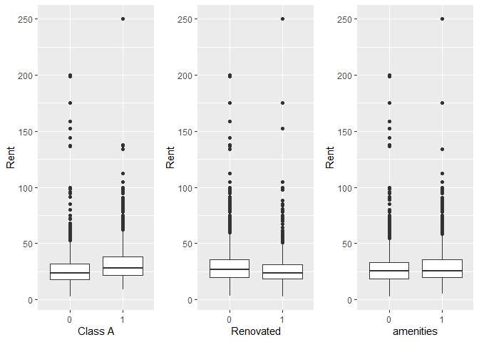
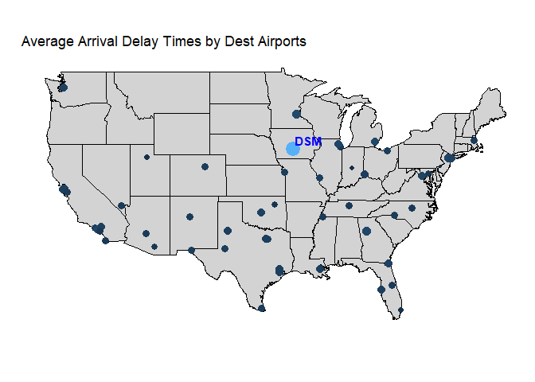
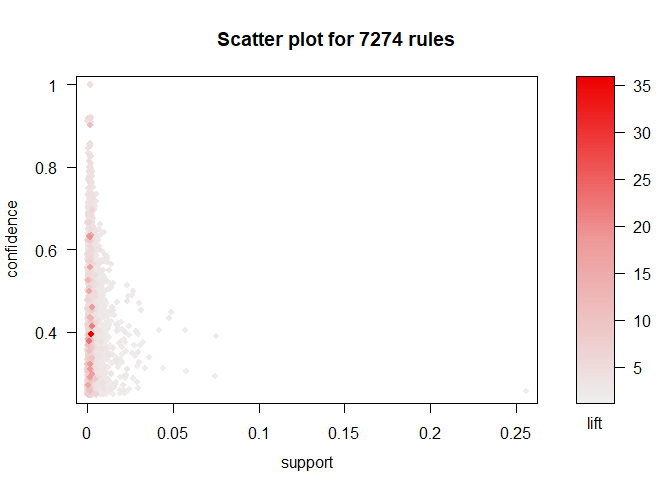

Visual Story Telling Part 1: green buildings
============================================

Read in the data and look at leasing rate to remove any outlier

    greenbuilding <- read_csv("./data/greenbuildings.csv")

    ## Parsed with column specification:
    ## cols(
    ##   .default = col_double()
    ## )

    ## See spec(...) for full column specifications.

    greenbuilding <- na.omit(greenbuilding)
    attach(greenbuilding)
    summary(greenbuilding)

    ##  CS_PropertyID        cluster            size            empl_gr       
    ##  Min.   :      1   Min.   :   1.0   Min.   :   1624   Min.   :-24.950  
    ##  1st Qu.: 157407   1st Qu.: 272.0   1st Qu.:  50992   1st Qu.:  1.740  
    ##  Median : 313253   Median : 476.0   Median : 128838   Median :  1.970  
    ##  Mean   : 451337   Mean   : 590.3   Mean   : 234836   Mean   :  3.207  
    ##  3rd Qu.: 441062   3rd Qu.:1044.0   3rd Qu.: 294000   3rd Qu.:  2.380  
    ##  Max.   :6208103   Max.   :1230.0   Max.   :3781045   Max.   : 67.780  
    ##       Rent         leasing_rate       stories            age       
    ##  Min.   :  2.98   Min.   :  0.00   Min.   :  1.00   Min.   :  0.0  
    ##  1st Qu.: 19.50   1st Qu.: 77.89   1st Qu.:  4.00   1st Qu.: 23.0  
    ##  Median : 25.20   Median : 89.54   Median : 10.00   Median : 34.0  
    ##  Mean   : 28.42   Mean   : 82.63   Mean   : 13.59   Mean   : 47.1  
    ##  3rd Qu.: 34.18   3rd Qu.: 96.50   3rd Qu.: 19.00   3rd Qu.: 79.0  
    ##  Max.   :250.00   Max.   :100.00   Max.   :110.00   Max.   :171.0  
    ##    renovated         class_a          class_b            LEED         
    ##  Min.   :0.0000   Min.   :0.0000   Min.   :0.0000   Min.   :0.000000  
    ##  1st Qu.:0.0000   1st Qu.:0.0000   1st Qu.:0.0000   1st Qu.:0.000000  
    ##  Median :0.0000   Median :0.0000   Median :0.0000   Median :0.000000  
    ##  Mean   :0.3788   Mean   :0.3988   Mean   :0.4596   Mean   :0.006905  
    ##  3rd Qu.:1.0000   3rd Qu.:1.0000   3rd Qu.:1.0000   3rd Qu.:0.000000  
    ##  Max.   :1.0000   Max.   :1.0000   Max.   :1.0000   Max.   :1.000000  
    ##    Energystar       green_rating          net            amenities     
    ##  Min.   :0.00000   Min.   :0.00000   Min.   :0.00000   Min.   :0.0000  
    ##  1st Qu.:0.00000   1st Qu.:0.00000   1st Qu.:0.00000   1st Qu.:0.0000  
    ##  Median :0.00000   Median :0.00000   Median :0.00000   Median :1.0000  
    ##  Mean   :0.08082   Mean   :0.08683   Mean   :0.03504   Mean   :0.5262  
    ##  3rd Qu.:0.00000   3rd Qu.:0.00000   3rd Qu.:0.00000   3rd Qu.:1.0000  
    ##  Max.   :1.00000   Max.   :1.00000   Max.   :1.00000   Max.   :1.0000  
    ##   cd_total_07     hd_total07    total_dd_07   Precipitation  
    ##  Min.   :  39   Min.   :   0   Min.   :2103   Min.   :10.46  
    ##  1st Qu.: 684   1st Qu.:1419   1st Qu.:2869   1st Qu.:22.71  
    ##  Median : 966   Median :2739   Median :4979   Median :23.16  
    ##  Mean   :1232   Mean   :3410   Mean   :4642   Mean   :30.84  
    ##  3rd Qu.:1620   3rd Qu.:4796   3rd Qu.:6363   3rd Qu.:42.57  
    ##  Max.   :5240   Max.   :7200   Max.   :8244   Max.   :57.00  
    ##    Gas_Costs        Electricity_Costs  cluster_rent  
    ##  Min.   :0.009487   Min.   :0.01780   Min.   : 9.00  
    ##  1st Qu.:0.010296   1st Qu.:0.02330   1st Qu.:20.17  
    ##  Median :0.010296   Median :0.03095   Median :25.14  
    ##  Mean   :0.011305   Mean   :0.03084   Mean   :27.51  
    ##  3rd Qu.:0.011816   3rd Qu.:0.03781   3rd Qu.:34.09  
    ##  Max.   :0.028914   Max.   :0.06280   Max.   :71.44

    boxplot(leasing_rate)

Remove buildings with occupancy rate &lt; 10

    greenbuilding<-greenbuilding[!(greenbuilding$leasing_rate<10),]

Our team does not agree with the analysis of stats guru as he is using a
single feature - green status to make a prediction about the rent of the
new project while making the assumption that green status alone can well
explain the variance of data. This assumption is invalid and we will
explore the data to show why it is wrong.

Make a correlation matrix to investigate the association between Rent
and other continuous variables. We notice that *Rent* has strong
positive correlation with *Cluster Rent* and moderate positive
correlation *Electricity\_Costs*. It also has a weak negative
correlation with *total\_dd\_07*

Investigate the distribution of rent based on categorical variables with
boxplots. *ClassA* buildings have a higher median of Rent. Buildings
that haven’t been renovated yet also have a higher median of Rent.

    greenbuilding %>%
      group_by(class_a) %>%
      summarize(median_rent = median(Rent,na.rm=TRUE))

    ## `summarise()` ungrouping output (override with `.groups` argument)

    ## # A tibble: 2 x 2
    ##   class_a median_rent
    ##   <fct>         <dbl>
    ## 1 0              23.9
    ## 2 1              28.2

    greenbuilding %>%
      group_by(renovated) %>%
      summarize(median_rent = median(Rent,na.rm=TRUE))

    ## `summarise()` ungrouping output (override with `.groups` argument)

    ## # A tibble: 2 x 2
    ##   renovated median_rent
    ##   <fct>           <dbl>
    ## 1 0                27  
    ## 2 1                23.5

As we can see here, other variables also have relatively significant
correlation with Rent, thus simply predicting the future rent with green
status may lead to the problem of not capturing enough information from
the dataset.

Next we are going to investigate the relationship between class\_a and
green\_rating to check if it is a confounding variable for the
relationship between rent and green status.

The proportion of green buildings by class

    library(tidyverse)
    green_class = greenbuilding %>%
      group_by(green_rating) %>%
      summarize(classA = sum(class_a == 1)/n(),
                classB = sum(class_b == 1)/n(),
                classC = sum(class_a == 0 & class_b ==0)/n())

    ## `summarise()` ungrouping output (override with `.groups` argument)

    green_class

    ## # A tibble: 2 x 4
    ##   green_rating classA classB classC
    ##   <fct>         <dbl>  <dbl>  <dbl>
    ## 1 0             0.369  0.485 0.146 
    ## 2 1             0.796  0.193 0.0103

    green_class_long <- green_class %>%
                      gather(class, value, -green_rating)

    ggplot(green_class_long, aes(fill=class, y=value, x=green_rating)) + 
        geom_bar(position="stack", stat="identity", width = 0.5)+
         scale_fill_hue(c=45, l=80)

    onlygreen <- greenbuilding[greenbuilding$green_rating==1,]
    nongreen <- greenbuilding[!(greenbuilding$green_rating==1),]

    g1 <- ggplot(data=onlygreen,aes(x=class_a, y=Rent,color=class_a)) + 
      geom_boxplot() +
      labs(
        x = "Class A",
        y = "Rent",
        title='Green'
      )

    g2 <- ggplot(data=nongreen,aes(x=class_a, y=Rent,color=class_a)) + 
      geom_boxplot() +
      labs(
        x = "Class A",
        y = "Rent",
        title='Nongreen'
      )

    grid.arrange(g1, g2, nrow = 1)

Around **79.6%** of green buildings fall into the class A category
versus only **36.9%** non-green buildings are classified as A. The huge
difference in the proportion of class-A buildings could be the reason of
green buildings having a higher median rent value.

    c1<-ggplot(greenbuilding) + 
      geom_point(aes(x=cd_total_07, y=Rent,color=green_rating))

    c2<-ggplot(greenbuilding) + 
      geom_point(aes(x=hd_total07, y=Rent,color=green_rating))

    c3<-ggplot(greenbuilding) + 
      geom_point(aes(x=total_dd_07, y=Rent,color=green_rating))

    grid.arrange(c1, c2,c3, nrow = 3)

    l1 <- ggplot(data=greenbuilding,aes(x=green_rating, y=cd_total_07)) + 
      geom_boxplot() +
      labs(
        x = "Green_Rating",
        y = "cd_total_07"
      )

    l2  <- ggplot(data=greenbuilding,aes(x=green_rating, y=hd_total07)) + 
      geom_boxplot() +
      labs(
        x = "Green_Rating",
        y = "hd_total_07"
      )

    l3  <- ggplot(data=greenbuilding,aes(x=green_rating, y=total_dd_07)) + 
      geom_boxplot() +
      labs(
        x = "Green_Rating",
        y = "Total_dd_07"
      )

    grid.arrange(l1, l2,l3, nrow = 1)

We assume a reason for green building have higher rent is other cost
will be lower if living in the green building. However, when we do the
boxplots finding that green buildings can have lower usage heating
degree days, but keep same usage of cooling degree days. The new
building will be built in Austin where highly demand of cooling degree
days. Make the building green may not able to have a premium in rent.

Another reason that we don’t agree with the guru is that he assumes if
there is an extra revenue from green buildings, the revenue value keeps
fixed over years. Here we are going to hold *class\_a* constant, and
investigate the difference in rent between green and non-green buildings
over building ages.

When investigating all the class-A buildings, we found out the median
rent of green buildings is lower than non-green buildings within the age
range (5 - 9). And the rent price fluctuates with the change of building
age. Therefore, it is invalid for the guru to assume the extra revenue
will remain fixed over years until the costs for green building is
recuperated.

    classA <- greenbuilding[(greenbuilding$class_a == 1),]
    age_lessthan10 <- classA[(classA$age <= 10),]

    median_over_age <- age_lessthan10 %>%
      group_by(green_rating, age) %>%
      summarize(median_rent = median(Rent,na.rm=TRUE))

    ## `summarise()` regrouping output by 'green_rating' (override with `.groups` argument)

    ggplot(median_over_age, aes(x=age, y=median_rent, group=green_rating, color=green_rating)) +
        geom_line()+
      geom_point(shape = 10)

Future Recommendations:

-   Green certificate may not be the reason of premium in the rent,
    since more green buildings are class A buildings here, which led to
    higher rent for green buildings.

-   If green buildings can have lower usage of heating degree days which
    led to higher rent, the green certificate will not affect rent of
    buildings in Austin, because Austin demand more in cooling degree
    days.

-   From the time series plot of how green and nongreen buildings rent
    change with the age of buildings increase, it shows the rent of
    green builidng is not always higher than nongreen building. It will
    make harder to get the cost on getting green certificate back.

-   To make more accurate analysis, we should filter out the building
    clusters with similar feature of the new project building. We can
    use clustering to select the clusters, and then analyze all the
    factors to determine if going green can make the premium in rent.

Visual Story Telling Part 2: flights at ABIA
============================================

We want figure out to how to minimize delays, by looking into different
variables in the dataset.

Loading libraries for data visualization and maps.

Reading files:

-   **‘ABIA.csv’** contains information on every commercial flight in
    2008 that either departed from or landed at Austin-Bergstrom
    Interational Airport.
-   **‘airports\_code.csv’** contains the airport code of all airports
    around the world, as well as the longtitude and latitude for each
    airport.

<!-- -->

    ABIA <- read_csv("./data/ABIA.csv")

    ## Parsed with column specification:
    ## cols(
    ##   .default = col_double(),
    ##   UniqueCarrier = col_character(),
    ##   TailNum = col_character(),
    ##   Origin = col_character(),
    ##   Dest = col_character(),
    ##   CancellationCode = col_character()
    ## )

    ## See spec(...) for full column specifications.

    airports_code = read.csv('./data/airports_code.csv', header=FALSE)
    airports_code = airports_code[,c('V5','V7','V8')]
    attach(ABIA)

Basic analysis on Arrival Delay and Departure Delay:

First, we draw the histogram to show the distribution of arrival delays
and departure delays.From the histograms, we can see that both ArrDelay
and DepDelay are centered around 0. The overall trend of both graphs are
very similar.

    ggplot(data = ABIA, aes(x=ArrDelay)) + 
      geom_histogram(bins = 100, binwidth = 10) + 
      xlab('Arrival Delay') +
      ggtitle('Distribution of Arrival Delays')

    ggplot(data = ABIA, aes(x=DepDelay)) + 
      geom_histogram(bins = 100, binwidth = 10) + 
      xlab('Departure Delay') +
      ggtitle('Distribution of Departure Delays')

Then we draw the scatter plot to analyze the correlation between arrival
delay and departure delay.From the graph below, we found out that
arrival delay and departure delay have a clear positive linear
relationship. In cases where departure delay is the same, arrival delay
decreases as distance increases.

    pl2 <- ggplot(data = ABIA) + 
      geom_point(mapping = aes(x = DepDelay, y = ArrDelay, 
                               color = Distance))
    print(pl2 +
            xlab('Departure Delay') +
            ylab('Arrival Delay'))

Which month in a year is the best month to fly in order to minimize
delays?

We draw a bar graph to show the frequency of flights over months. We
also draw one scatter plot and one line graph to capture the trend of
delays over months.

-   From the line graph, we can find out that arrival delays are always
    lower than departure delays.
-   Average arrival delays and average departure delays are relatively
    lower during September, October, and November. Therefore, those
    three months could be good choices to fly to minimize delays.

<!-- -->

    ggplot(data = ABIA, aes(x=Month)) + 
      geom_bar() + 
      ggtitle("Number of flights by Month") +
      ylab('Number of flights') + 
      scale_x_continuous("Month",limits=c(0,13), breaks=0:13)

    ggplot(data = ABIA) + 
      geom_point(mapping = aes(x = Month, y = ArrDelay+DepDelay,
                               colour=Distance)) +
      labs(title="Average Delays by Month")+
      scale_x_continuous("Month", limits=c(1,12), breaks=1:12)

    ABIA.arragg = aggregate(ArrDelay ~ Month, ABIA, mean)
    ABIA.depagg = aggregate(DepDelay ~ Month, ABIA, mean)
    ggplot() +
      geom_line(data=ABIA.arragg, 
                aes(x=Month, y=ArrDelay, 
                    colour="Arrival Delay")) +
      geom_line(data=ABIA.depagg, 
                aes(x=Month, y=DepDelay, 
                    colour="Departure Delay"))+

      scale_color_manual(values=c("red", "orange")) +
      scale_y_continuous("Average Delay")+
      labs(title="Average Delays by Month")+
      scale_x_continuous("Month", limits=c(1,12), breaks=1:12)

Which time in a day is the best time to fly in order to minimize delays?

We draw a bar graph to show the frequency of flights over scheduled
departure time in one entire day. Moreover, we also draw one scatter
plot and one line graph to capture the trend of average delays over
entire day.

-   From the bar graph, we can see that the scheduled departure time are
    mostly from 6 AM to 11 PM.
-   From the line graph, we can find out that for most of times, arrival
    delays are lower than departure delays.
-   Average arrival delays and average departure delays are relatively
    lower in the early morning, like from 6 AM to 10 AM. Therefore,
    people should choose to fly in the morning to minimize delays.

<!-- -->

    ABIA$CRSDepTime2 <- as.integer(CRSDepTime/100)+1

    ggplot(data = ABIA, aes(x=CRSDepTime2)) + 
      geom_bar() + 
      ggtitle("Number of flights by Scheduled depart time") +
      ylab('Number of flights') + 
      scale_x_continuous("Scheduled depart time",limits=c(0,24),breaks=0:24)

    ggplot(data = ABIA) + 
      geom_point(mapping = aes(x = CRSDepTime2, y = ArrDelay+DepDelay,
                               colour=Distance)) +
      labs(title = "Delay Time Over one Entire Day")+
      scale_x_continuous("CRSDepTime",limits=c(0,24),breaks=0:24)

    ABIA.arragg = aggregate(ArrDelay ~ CRSDepTime2, ABIA[ABIA$CRSDepTime2>5,], mean)
    ABIA.depagg = aggregate(DepDelay ~ CRSDepTime2, ABIA[ABIA$CRSDepTime2>5,], mean)
    ggplot() +
      geom_line(data=ABIA.arragg, 
                aes(x=CRSDepTime2, y=ArrDelay, 
                    colour="Arrival Delay")) +
      geom_line(data=ABIA.depagg, 
                aes(x=CRSDepTime2, y=DepDelay, 
                    colour="Departure Delay"))+

      scale_color_manual(values=c("red", "orange")) +
      scale_y_continuous("Average Delay")+
      labs(title="Average Delays Over one Entire Day")+
      scale_x_continuous("CRSDepTime",limits=c(0,24),breaks=0:24)

Which day in a week is the best day to fly in order to minimize delays?

We draw a bar graph to show the frequency of flights over days in a
week. Moreover, we also draw one scatter plot and one line graph to
capture the trend of average delays over a week.

-   From the line graph, we can find out that arrival delays are always
    lower than departure delays.
-   Average arrival delays and average departure delays are relatively
    lower on Wednesday and Saturday. Therefore, people should choose
    those two days to fly in order to minimize delays.

<!-- -->

    ggplot(data = ABIA, aes(x=DayOfWeek)) + 
      geom_bar() + 
      ggtitle("Number of flights by DayOfWeek") +
      ylab('Number of flights') + 
      scale_x_continuous("DayOfWeek (Monday to Sunday)",breaks=0:7)

    ggplot(data = ABIA) + 
      geom_point(mapping = aes(x = DayOfWeek, y = ArrDelay+DepDelay,
                               colour=Distance)) +
      labs(title="Average Delays by DayOfWeek (Monday to Sunday)")+
      scale_x_continuous("DayOfWeek: 1 (Monday) - 7 (Sunday)",breaks=1:7)

    ABIA.arragg = aggregate(ArrDelay ~ DayOfWeek, ABIA, mean)
    ABIA.depagg = aggregate(DepDelay ~ DayOfWeek, ABIA, mean)
    ggplot() +
      geom_line(data=ABIA.arragg, 
                aes(x=DayOfWeek, y=ArrDelay, 
                    colour="Arrival Delay")) +
      geom_line(data=ABIA.depagg, 
                aes(x=DayOfWeek, y=DepDelay, 
                    colour="Departure Delay"))+

      scale_color_manual(values=c("red", "orange")) +
      scale_y_continuous("Average Delay")+
      labs(title="Average Delays by DayOfWeek (Monday to Sunday)")+
      scale_x_continuous("DayOfWeek: 1 (Monday) - 7 (Sunday)",breaks=1:7)

How to choose the flight carrier in order to minimize delays?

We first draw a bar graph to show the frequency of flights over
different flight carriers. Then we draw one scatter plot and another bar
graph to capture the average delays for different flight carriers.

-   From the first bar graph, we find out AA and WN highest the highest
    frequency of flights.
-   From the second bar graph, we find out the average delay time for F9
    and US are relatively lower than others. Therefore, we could choose
    those two carriers to minimize delays.
-   From the second bar graph, average arrival delays and average
    departure delays are relatively higher for B6 and YV, people should
    aviod taking fights of those two carriers if they want to have less
    delays.

<!-- -->

    ABIA2 = ABIA[,-c(23)]
    ABIA2 <- na.omit(ABIA2)

    ggplot(data = ABIA2, aes(x=UniqueCarrier)) + 
      geom_bar() + 
      ggtitle("Number of flights by UniqueCarrier") +
      ylab('Number of flights') + 
      xlab("UniqueCarrier")

    ggplot(data = ABIA2) + 
      geom_point(mapping = aes(x = UniqueCarrier, y = ArrDelay+DepDelay,
                               colour=Distance)) +
      labs(title="Average Delays by UniqueCarrier")+
      xlab("UniqueCarrier")

    d1 = ABIA2 %>%
      group_by(UniqueCarrier) %>%
      summarise(ArrDelay = mean(ArrDelay), 
                DepDelay = mean(DepDelay))

    ## `summarise()` ungrouping output (override with `.groups` argument)

    df <- melt(d1, id.vars = 'UniqueCarrier')
    pl1 <- ggplot(data=subset(df, df$variable != 'total_operations'), 
                  aes(x=UniqueCarrier, y=value, fill=variable)) +
      geom_bar(stat="identity", position='dodge') +
      ggtitle('Average Delay by UniqueCarrier') +
      xlab('UniqueCarrier') +
      ylab('Average Delay')
    pl1

Choose which airport to fly in order to minimize delays?

We first draw two bar graph to show the frequency of flights over
different origin and destination cities. Then we draw one scatter plot
on US map to visualize the delay time.

-   From the first map graph, which shows flights from other orgin cites
    to Austin Airport, we find out that the average delays are the
    highest for OKC and TYS. Thus, people should avoid taking fights
    from those two airports to Austin-Bergstrom Interational Airport in
    order to minimize delays.
-   From the second map graph, which shows flights from Austin Airport
    to other Destination cites, we find out that the average delays are
    the highest for DSM and STL Thus, people should avoid fly from
    Austin to those two airports in order to minimize delays.

<!-- -->

    arrivals <- ABIA [(ABIA$Dest == "AUS") & ABIA$Cancelled==0,]
    departures <- ABIA[(ABIA$Origin=="AUS") & ABIA$Cancelled==0,]

    arrivals.agg = aggregate(ArrDelay ~ Origin, arrivals, mean)
    departures.agg = aggregate(ArrDelay ~ Dest, departures, mean)

    arrivals.m = merge(arrivals.agg, airports_code, by.x="Origin", by.y="V5")
    departures.m = merge(departures.agg, airports_code, by.x="Dest", by.y="V5")

    ggplot(data = arrivals, aes(x=Origin)) + 
      geom_bar() + 
      ggtitle("Number of flights by Origin City") +
      ylab('Number of flights') + 
      xlab("Origin City") +
      theme(axis.text.x = element_text(angle = 90,vjust = 0.3))

    ggplot(data = departures, aes(x=Dest)) + 
      geom_bar() + 
      ggtitle("Number of flights by Destination City") +
      ylab('Number of flights') + 
      xlab("Destination City") +
      theme(axis.text.x = element_text(angle = 90,vjust = 0.3))

    map.opts <- theme(panel.grid.minor=element_blank(), 
                      panel.grid.major=element_blank(),
                      panel.background=element_blank(), 
                      axis.title.x=element_blank(), 
                      axis.title.y=element_blank(), 
                      axis.line=element_blank(), 
                      axis.ticks=element_blank(), 
                      axis.text.y = element_text(colour="#FFFFFF"), 
                      axis.text.x = element_text(colour = "#FFFFFF"))

    states <- map_data("state")
    aus_dep_text <- arrivals.m %>% filter(ArrDelay > 80)
    p1 <- ggplot(states) + 
      geom_polygon(aes(x = long, y = lat,group=group),color='black',fill='lightgrey') + 
      map.opts  + 
      coord_fixed(1.3) + 
      geom_point(data=arrivals.m, aes(x=V8,y=V7,size=ArrDelay,color=ArrDelay)) +
      geom_text_repel(data=aus_dep_text,aes(x=V8,y=V7,label=Origin),
                      fontface = 'bold', color = 'blue',) +  
      guides(color=FALSE,size=FALSE) + 
      labs(title = "Average Arrival Delay Times by Origin Airports")
    p1

    aus_dep_text <- departures.m %>% filter(ArrDelay > 80)

    p2 <- ggplot(states) + 
      geom_polygon(aes(x = long, y = lat,group=group),color='black',fill='lightgrey') + 
      map.opts  + 
      coord_fixed(1.3) + 
      geom_point(data=departures.m, aes(x=V8,y=V7,size=ArrDelay,color=ArrDelay)) +
      geom_text_repel(data=aus_dep_text,aes(x=V8,y=V7,label=Dest),
                      fontface = 'bold', color = 'blue',) +  
      guides(color=FALSE,size=FALSE) + 
      labs(title = "Average Arrival Delay Times by Dest Airports")
    p2

Portfolio Modeling
==================

Goal and Overview:

-   We created three portfolios investing in three categories of ETFs to
    test their respective four-trading-week Value at Risk at the 5%
    level using past five years of data (starting from 2015-08-01). The
    three categories we picked are US Equities, US Bonds and
    Commodities. We decided to allocate $100,000 for each of the three
    portfolios and each of them would contain five ETFs with equal
    weights (20% in each ETF) which we assume to rebalance daily. This
    way, each of the ETF in a portfolio will always contain 20% of total
    wealth at the beginning of each trading day.

US Diversified Equities Portfolio

    mystocks1 = c("SPY", "ONEQ", "DIA", "XLU", "XLP")
    myprices = getSymbols(mystocks1, from = "2015-08-01")

    ## 'getSymbols' currently uses auto.assign=TRUE by default, but will
    ## use auto.assign=FALSE in 0.5-0. You will still be able to use
    ## 'loadSymbols' to automatically load data. getOption("getSymbols.env")
    ## and getOption("getSymbols.auto.assign") will still be checked for
    ## alternate defaults.
    ## 
    ## This message is shown once per session and may be disabled by setting 
    ## options("getSymbols.warning4.0"=FALSE). See ?getSymbols for details.

    for(ticker in mystocks1) {
      expr = paste0(ticker, "a = adjustOHLC(", ticker, ")")
      eval(parse(text=expr))
    }

    # Combine all the returns in a matrix
    all_returns1 = cbind(   ClCl(SPYa),
                         ClCl(ONEQa),
                         ClCl(DIAa),
                         ClCl(XLUa),
                         ClCl(XLPa))
    all_returns1 = as.matrix(na.omit(all_returns1))

-   For this portfolio, we picked well diversified ETFs that represent
    multiple sectors or a particular sector of the US economy. This
    portfolio contains the follow ETFs:
-   SPY: Beta = 1; Weight = 20%
-   ONEQ: Beta = 1.07; Weight = 20%
-   DIA: Beta = 0.99; Weight = 20%
-   XLU: Beta = 0.42; Weight = 20%
-   XLP: Beta = 0.58; Weight = 20%
-   The first ETF we included is SPY which tracks the S&P 500 Index and
    tend to cover an extensive list of companies that spans multiple
    sectors. SPY is itself diversified and tend to be considered
    representative of the US Equity Market overall. But we are not
    satisfied with only one ETF and would like to further diversify our
    portfolio, so we decided to give extra weights to some of the
    sectors. We gave extra weight to the industrial and technology
    sectors as we think they have relatively high potential and will,
    therefore, bring in more growth to the portfolio. As a result, we
    decided to include ONEQ and DIA which track the NASDAQ and DOWs
    respectively in our portfolio. On the other hand, we also want to
    lessen the risk (in terms of Beta) of the portfolio so we decided to
    also weight in on the Utilities and Consumer Staples sectors as they
    tend to be less volatile. To do so, we invested in XLU and XLP. With
    these ETFs on hand, our portfolio has a weighted average Beta of
    0.812, which is slightly less risky than the market.

US All-Bonds Portfolio

    mystocks2 = c("SHY", "LQD", "IBMI", "HYG", "ICSH")
    myprices = getSymbols(mystocks2, from = "2015-08-01")

    for(ticker in mystocks2) {
      expr = paste0(ticker, "a = adjustOHLC(", ticker, ")")
      eval(parse(text=expr))
    }

    # Combine all the returns in a matrix
    all_returns2 = cbind(   ClCl(SHYa),
                         ClCl(LQDa),
                         ClCl(IBMIa),
                         ClCl(HYGa),
                         ClCl(ICSHa))
    all_returns2 = as.matrix(na.omit(all_returns2))

-   For this portfolio, we picked ETFs that represent different
    categories of bonds in terms of level of risk on underlying asset
    and time to maturity based in the US. This portfolio contains the
    follow ETFs:
-   SHY: Beta = 0.23; Weight = 20%
-   SHV: Beta = 0.01; Weight = 20%
-   IBMI: Beta = 0.08; Weight = 20%
-   LQD: Beta = 0.35; Weight = 20%
-   HYG: Beta = 1.65; Weight = 20%
-   Our aim for this portfolio is to earn stable return while taking a
    limited amount of risk. To do so, we attributed 60% of our wealth in
    short-term T-Bill (IBMI), 1 ~ 3 years T-Bonds (SHY), and Municipal
    Bonds (SHV) respectively with an equal weight. This way, since these
    bonds are either backed by the US Treasury of state governments, the
    default risk is near zero implies an extremely low risk as indicated
    by their Betas. However, the price for the low risk is a low return.
    To remedy the low return, we, then, attributed 20% of wealth to
    invest in High Yield Bond (HYG) and Investment Grades Bonds (LQD) as
    they tend to have a higher return. With these ETFs on hand, this
    portfolio has a weighted average Beta of 0.464.

Commodities ETF Portfolio

    mystocks3 = c("SLV", "SOYB", "UNG", "USO", "CPER")
    myprices = getSymbols(mystocks3, from = "2015-08-01")

    for(ticker in mystocks3) {
      expr = paste0(ticker, "a = adjustOHLC(", ticker, ")")
      eval(parse(text=expr))
    }

    # Combine all the returns in a matrix
    all_returns3 = cbind(   ClCl(SLVa),
                         ClCl(SOYBa),
                         ClCl(UNGa),
                         ClCl(USOa),
                         ClCl(CPERa))
    all_returns3 = as.matrix(na.omit(all_returns3))

-   For this portfolio, we decided to invest in various commodity ETFs
    to see how much more/less risky when compared to the Diversified
    Equities Portfolio and the All-Bonds Portfolio. This portfolio
    contains the follow ETFs:
-   SLV: Beta = 0.23; Weight = 20%
-   CPER: Beta = 0.01; Weight = 20%
-   UNG: Beta = 0.08; Weight = 20%
-   USO: Beta = 0.35; Weight = 20%
-   SPYB: Beta = 1.65; Weight = 20%
-   We created the portfolio by investing in ETFs that tracks a single
    commodity type. In particular, the commodities we picked includes
    silver (SLV), copper (CPER), natural gas (UNG), US Oil (USO), and
    soybean (SOYB). These are all actively traded commodities in the
    market that cover multiple aspects including metals, energy, and
    agriculture. Since commodities tend to be more volatile, the Beta
    for this portfolio is also the highest at 0.856.

VaR and Comparisons

    ##########################################################################
    # US Diversified-Equities Portfolio
    ##########################################################################

    # Simulate many different possible futures for a period of 20 trading days
    initial_wealth = 100000
    sim1 = foreach(i=1:5000, .combine='rbind') %do% {
      total_wealth = initial_wealth
      weights = c(0.2, 0.2, 0.2, 0.2, 0.2)
      holdings = weights * total_wealth
      n_days = 20
      wealthtracker = rep(0, n_days)
      for(today in 1:n_days) {
        return.today = resample(all_returns1, 1, orig.ids=FALSE)
        holdings = holdings + holdings*return.today
        total_wealth = sum(holdings)
        wealthtracker[today] = total_wealth
      }
      wealthtracker
    }

    # Wealth Distribution for 20 trading days
    hist(sim1[,n_days], 25, col = "light yellow", 
         main = "US Diversified Portfolio_Wealth", xlab = "Total Wealth")

    # Profit/loss
    mean(sim1[,n_days])

    ## [1] 101148.9

    mean(sim1[,n_days] - initial_wealth)

    ## [1] 1148.883

    hist(sim1[,n_days]- initial_wealth, breaks=30, col = "light yellow",
         main = "US Diversified Portfolio_Gain/Loss", xlab = "Total Dollar Gain/Loss")

    # 5% value at risk at dollar value:
    VaR_1 <- quantile(sim1[,n_days]- initial_wealth, prob=0.05)
    VaR_1

    ##        5% 
    ## -6816.288

    ## 5% value at risk in terms of return:
    VaR_1_r <- VaR_1/100000
    VaR_1_r

    ##          5% 
    ## -0.06816288

    ##########################################################################
    # US All-Bonds Portfolio:
    ##########################################################################

    # Simulate many different possible futures for a period of 20 trading days
    initial_wealth = 100000
    sim2 = foreach(i=1:5000, .combine='rbind') %do% {
      total_wealth = initial_wealth
      weights = c(0.2, 0.2, 0.2, 0.2, 0.2)
      holdings = weights * total_wealth
      n_days = 20
      wealthtracker = rep(0, n_days)
      for(today in 1:n_days) {
        return.today = resample(all_returns2, 1, orig.ids=FALSE)
        holdings = holdings + holdings*return.today
        total_wealth = sum(holdings)
        wealthtracker[today] = total_wealth
      }
      wealthtracker
    }

    # Wealth Distribution for 20 trading days
    hist(sim2[,n_days], 25, col = "light blue", 
         main = "US Bonds Portfolio_Wealth", xlab = "Total Wealth")

    # Profit/loss
    mean(sim2[,n_days])

    ## [1] 100279.5

    mean(sim2[,n_days] - initial_wealth)

    ## [1] 279.5222

    hist(sim2[,n_days]- initial_wealth, breaks=30, col = "light blue", 
         main = "US Bonds Portfolio_Gain/Loss", xlab = "Total Dollar Gain/Loss")

    # 5% value at risk at dollar value:
    VaR_2 <- quantile(sim2[,n_days]- initial_wealth, prob=0.05)
    VaR_2

    ##        5% 
    ## -1301.447

    ## 5% value at risk in terms of return:
    VaR_2_r <- VaR_2/100000
    VaR_2_r

    ##          5% 
    ## -0.01301447

    ##########################################################################
    # Commodities ETF Portfolio:
    ##########################################################################

    mystocks3 = c("SLV", "SOYB", "UNG", "USO", "CPER")
    myprices = getSymbols(mystocks3, from = "2015-08-01")

    for(ticker in mystocks3) {
      expr = paste0(ticker, "a = adjustOHLC(", ticker, ")")
      eval(parse(text=expr))
    }

    # Combine all the returns in a matrix
    all_returns3 = cbind(   ClCl(SLVa),
                         ClCl(SOYBa),
                         ClCl(UNGa),
                         ClCl(USOa),
                         ClCl(CPERa))
    all_returns3 = as.matrix(na.omit(all_returns3))

    # Simulate many different possible futures for a period of 20 trading days
    initial_wealth = 100000
    sim3 = foreach(i=1:5000, .combine='rbind') %do% {
      total_wealth = initial_wealth
      weights = c(0.2, 0.2, 0.2, 0.2, 0.2)
      holdings = weights * total_wealth
      n_days = 20
      wealthtracker = rep(0, n_days)
      for(today in 1:n_days) {
        return.today = resample(all_returns3, 1, orig.ids=FALSE)
        holdings = holdings + holdings*return.today
        total_wealth = sum(holdings)
        wealthtracker[today] = total_wealth
      }
      wealthtracker
    }

    # Wealth Distribution for 20 trading days
    hist(sim3[,n_days], 25, col = "light green", 
         main = "Commodities Portfolio_Wealth", xlab = "Total Wealth")

    # Profit/loss
    mean(sim3[,n_days])

    ## [1] 99178.59

    mean(sim3[,n_days] - initial_wealth)

    ## [1] -821.4124

    hist(sim3[,n_days]- initial_wealth, breaks=30,, col = "light green", 
         main = "Commodities Portfolio_Gain/Loss", xlab = "Total Dollar Gain/Loss")

    # 5% value at risk at dollar value:
    VaR_3 <- quantile(sim3[,n_days]- initial_wealth, prob=0.05)
    VaR_3

    ##        5% 
    ## -9948.075

    ## 5% value at risk in terms of return:
    VaR_3_r <- VaR_3/100000
    VaR_3_r

    ##          5% 
    ## -0.09948075

-   With computations done in R, we obtained the following results for
    5% Value at Risk (in terms of dollar amount and return) for the
    three portfolios we have on hand:
-   US Diversified-Equities Portfolio: -$6,997.02 or -6.997%
-   US All-Bonds Portfolio: -$1,332.36 or -1.332%
-   Commodities ETF Portfolio: -$9,862.39 or -9.86%
-   Interpreting the results, if we were to invest 100,000 in each of
    the portfolios for 20 trading days with daily rebalancing, then
    there is a 5% chance for our total gain/loss for (1) the US
    Diversified-Equities Portfolio to be less than -6,997.02 or
    -6.997%, (2) the US All-Bonds Portfolio to be less than -1,332.36 or
    -1.332%, (3) the Commodities ETF Portfolio to be -$9,862.39 or
    -9.86%.
-   Focusing on the factor this figure is only based on a month of
    trading, it is quite insane we could have lost close to 10% of our
    wealth in the more risky portfolio and 1.3% even for the safest
    portfolio where majority of the wealth is invested in
    government-backed bonds. That being said, on the other hand, we also
    need to realize that this is only a 5% tail-end (left) probability,
    and there is another 95% chance that we will earn mode/lose less
    than the amounts calculated above. But it is worth noting the
    kurtosis risk, when quantified, could be quite scary and
    significantly different to what we thought it is (i.e. in terms of
    Beta and standard deviation).
-   Finally, looking at the three drastically different VaRs of the
    three portfolio, we can see that even though the Betas between the
    Commodities and All-Equities portfolios are similar the tail-end
    risk could really magnify this different as we simulated a 3.35%.
    This is again confirmed if we look at the safer All-bonds portfolio
    with the Commodity portfolio. With a quite All-Bond’s Beta almost
    halving that of Commodities’ the difference in tail-end loss could
    be magnified to a point where the loss in commodity portfolio is
    8.65x that of All-bonds. To conclude, the risk (betas) we mention
    daily that seem normal could really be a lot more daunting than what
    we thought it is and carefully accessing the tail-end risk with
    simulations are really necessary before making any investments.

Market Segmentation
===================

Problem: Your task to is analyze this data as you see fit, and to
prepare a concise report for NutrientH20 that identifies any interesting
market segments that appear to stand out in their social-media audience.

    library(ggplot2)
    library(tidyverse)
    library(foreach)
    library(mosaic)
    library(fpc)
    library(gridExtra)

    mkt = read.csv('./data/social_marketing.csv',header=TRUE, row.names=1)
    mkt <- mkt[!(mkt$spam>0 | mkt$adult>0),]

    mkt <- mkt[,-c(1,5,35,36)]

    Zmkt = scale(mkt, center=TRUE, scale=TRUE)

Correlation

    cor(Zmkt)

    ##                  current_events        travel photo_sharing      tv_film
    ## current_events      1.000000000  0.0478568021   0.151722078  0.081641895
    ## travel              0.047856802  1.0000000000   0.027391877  0.100576310
    ## photo_sharing       0.151722078  0.0273918769   1.000000000  0.018399616
    ## tv_film             0.081641895  0.1005763097   0.018399616  1.000000000
    ## sports_fandom       0.062104540 -0.0090768863   0.017789250  0.028472581
    ## politics            0.064904952  0.6659134562   0.036081073  0.031961602
    ## food                0.059677068  0.0787926591   0.002078405  0.081526502
    ## family              0.062397209  0.0137817268   0.100759023  0.018396772
    ## home_and_garden     0.054138111  0.0454557122   0.082080181  0.109161774
    ## music               0.075449570  0.0376334802   0.143468673  0.278193944
    ## news                0.058072862  0.2555180585  -0.019264645  0.065999563
    ## online_gaming      -0.003560051  0.0126668098   0.035463918  0.041423227
    ## shopping            0.154025701  0.0203187956   0.538495879  0.036294708
    ## health_nutrition    0.017697135 -0.0111158487   0.029834260 -0.003005766
    ## college_uni         0.030824558  0.0542994655   0.060220378  0.207339608
    ## sports_playing      0.029677195  0.0588800992   0.093080078  0.101784154
    ## cooking             0.045327351  0.0196867548   0.355936051  0.002180244
    ## eco                 0.075086560  0.0595951240   0.181396720  0.063704670
    ## computers           0.051646248  0.6118178548   0.096973847 -0.003716869
    ## business            0.082015628  0.1701011189   0.186315710  0.103355304
    ## outdoors            0.013338424  0.0294111468   0.031178864  0.029995713
    ## crafts              0.075701838  0.0890254396   0.110259316  0.186122172
    ## automotive          0.070650324  0.0004227593   0.108016358  0.017774623
    ## art                 0.054624945  0.0881668864   0.025451158  0.496565117
    ## religion            0.064042897  0.0607151858   0.002473330  0.046419987
    ## beauty              0.071904256  0.0157472790   0.316057491  0.016354950
    ## parenting           0.046285159  0.0434265522   0.041414633 -0.002411266
    ## dating              0.023644754  0.0917737601   0.027596307  0.004070816
    ## school              0.067932700  0.0188754064   0.110686112  0.023718880
    ## personal_fitness    0.036823450 -0.0055401728   0.061611318 -0.002465923
    ## fashion             0.058434904  0.0258630925   0.345297465  0.016944851
    ## small_business      0.064376032  0.1237127424   0.143587028  0.188763927
    ##                  sports_fandom     politics        food     family
    ## current_events     0.062104540  0.064904952 0.059677068 0.06239721
    ## travel            -0.009076886  0.665913456 0.078792659 0.01378173
    ## photo_sharing      0.017789250  0.036081073 0.002078405 0.10075902
    ## tv_film            0.028472581  0.031961602 0.081526502 0.01839677
    ## sports_fandom      1.000000000  0.065354707 0.536702052 0.44366425
    ## politics           0.065354707  1.000000000 0.058893868 0.04483189
    ## food               0.536702052  0.058893868 1.000000000 0.37754841
    ## family             0.443664245  0.044831893 0.377548409 1.00000000
    ## home_and_garden    0.087624063  0.061364621 0.086662680 0.06657090
    ## music              0.049356043  0.003678628 0.070124292 0.03421560
    ## news               0.198133931  0.563940136 0.064843472 0.09334376
    ## online_gaming      0.023443826 -0.010088381 0.047857620 0.08092025
    ## shopping           0.024642665  0.040300126 0.018623110 0.08678877
    ## health_nutrition  -0.012084303 -0.020209599 0.223461605 0.02053913
    ## college_uni        0.024546299  0.006684138 0.047446232 0.06594642
    ## sports_playing     0.067841794  0.030649376 0.085867873 0.09538262
    ## cooking            0.004943423 -0.012968449 0.066154344 0.05035742
    ## eco                0.085929283  0.062751845 0.149001027 0.08472306
    ## computers          0.048696470  0.575833639 0.117407917 0.05774100
    ## business           0.065047647  0.156762451 0.073475819 0.05888406
    ## outdoors           0.061896627  0.072996889 0.193686266 0.04996822
    ## crafts             0.196866316  0.056932613 0.237963745 0.16913543
    ## automotive         0.236785604  0.286115949 0.055520841 0.14667996
    ## art                0.021406919  0.023858144 0.101393899 0.02624084
    ## religion           0.636883430  0.024488746 0.593325472 0.45123365
    ## beauty             0.121416778 -0.013750004 0.102794043 0.11659169
    ## parenting          0.610065255  0.039594422 0.549224974 0.41940235
    ## dating             0.016526852  0.077735012 0.034629523 0.02074084
    ## school             0.495120955  0.025678138 0.432460870 0.33751779
    ## personal_fitness   0.010272718 -0.010878663 0.221050006 0.03158802
    ## fashion            0.028408517 -0.009952289 0.033301997 0.05806349
    ## small_business     0.052748667  0.115556058 0.067403492 0.06120360
    ##                  home_and_garden       music         news online_gaming
    ## current_events        0.05413811 0.075449570  0.058072862 -0.0035600509
    ## travel                0.04545571 0.037633480  0.255518059  0.0126668098
    ## photo_sharing         0.08208018 0.143468673 -0.019264645  0.0354639177
    ## tv_film               0.10916177 0.278193944  0.065999563  0.0414232271
    ## sports_fandom         0.08762406 0.049356043  0.198133931  0.0234438265
    ## politics              0.06136462 0.003678628  0.563940136 -0.0100883809
    ## food                  0.08666268 0.070124292  0.064843472  0.0478576199
    ## family                0.06657090 0.034215596  0.093343765  0.0809202455
    ## home_and_garden       1.00000000 0.062890636  0.083169146  0.0362479272
    ## music                 0.06289064 1.000000000  0.011164743  0.0234056428
    ## news                  0.08316915 0.011164743  1.000000000 -0.0025052384
    ## online_gaming         0.03624793 0.023405643 -0.002505238  1.0000000000
    ## shopping              0.07449484 0.101842794 -0.018920132 -0.0127416561
    ## health_nutrition      0.05609950 0.047463836  0.015790838 -0.0020706382
    ## college_uni           0.06666704 0.186552308 -0.007795585  0.7755483681
    ## sports_playing        0.07118097 0.103672201  0.031785325  0.5008382142
    ## cooking               0.07042837 0.173058828  0.004988155  0.0379766462
    ## eco                   0.06675632 0.074517819  0.034635158  0.0329636238
    ## computers             0.05420967 0.045436386  0.215159152  0.0074815142
    ## business              0.05118824 0.102135241  0.053143546  0.0024452550
    ## outdoors              0.07053120 0.086239891  0.140211392  0.0034959211
    ## crafts                0.07681295 0.074331667  0.046875075  0.0406626100
    ## automotive            0.06402963 0.029920248  0.560092813  0.0427893159
    ## art                   0.10280878 0.022719757  0.040184563  0.0857155786
    ## religion              0.09621217 0.073618018  0.017380735  0.0091901946
    ## beauty                0.06880754 0.181649065  0.010528468  0.0070819333
    ## parenting             0.08066862 0.040057710  0.076031842  0.0241605481
    ## dating                0.11353603 0.011291902  0.046851201  0.0214007283
    ## school                0.10065106 0.045508931  0.052119748 -0.0007512159
    ## personal_fitness      0.07013074 0.045835944  0.028368195  0.0118807261
    ## fashion               0.07668744 0.164224815 -0.003759559  0.0411851307
    ## small_business        0.07560172 0.130967440  0.050401554  0.0439617048
    ##                      shopping health_nutrition  college_uni sports_playing
    ## current_events    0.154025701      0.017697135  0.030824558     0.02967720
    ## travel            0.020318796     -0.011115849  0.054299465     0.05888010
    ## photo_sharing     0.538495879      0.029834260  0.060220378     0.09308008
    ## tv_film           0.036294708     -0.003005766  0.207339608     0.10178415
    ## sports_fandom     0.024642665     -0.012084303  0.024546299     0.06784179
    ## politics          0.040300126     -0.020209599  0.006684138     0.03064938
    ## food              0.018623110      0.223461605  0.047446232     0.08586787
    ## family            0.086788771      0.020539129  0.065946416     0.09538262
    ## home_and_garden   0.074494839      0.056099498  0.066667039     0.07118097
    ## music             0.101842794      0.047463836  0.186552308     0.10367220
    ## news             -0.018920132      0.015790838 -0.007795585     0.03178533
    ## online_gaming    -0.012741656     -0.002070638  0.775548368     0.50083821
    ## shopping          1.000000000      0.028805758  0.023339602     0.02996191
    ## health_nutrition  0.028805758      1.000000000 -0.031577596     0.03453144
    ## college_uni       0.023339602     -0.031577596  1.000000000     0.51335015
    ## sports_playing    0.029961913      0.034531443  0.513350150     1.00000000
    ## cooking           0.084822887      0.243815845  0.035262841     0.10881945
    ## eco               0.171744932      0.224906525  0.034001383     0.05015174
    ## computers         0.067332668      0.024841268  0.031530114     0.05554138
    ## business          0.164776399      0.035138548  0.057632076     0.05650609
    ## outdoors          0.018168913      0.613206934 -0.000923756     0.04966327
    ## crafts            0.106772749      0.082509132  0.042784346     0.06963424
    ## automotive        0.110871546     -0.026114559  0.035896974     0.04510572
    ## art               0.029171653      0.035037256  0.092681801     0.05602995
    ## religion          0.004332915      0.008834602  0.029472633     0.07325915
    ## beauty            0.067392046      0.004663419  0.019872962     0.09356837
    ## parenting         0.019217417      0.029013734  0.007890769     0.06878834
    ## dating            0.004295044      0.074547093  0.025262030     0.09376552
    ## school            0.079930140      0.004711087 -0.006311224     0.06254567
    ## personal_fitness  0.053153821      0.809578387 -0.025963679     0.04272949
    ## fashion           0.096433608      0.026568096  0.056206069     0.10594401
    ## small_business    0.116090748     -0.010332235  0.120985291     0.08052952
    ##                       cooking        eco    computers    business     outdoors
    ## current_events    0.045327351 0.07508656  0.051646248 0.082015628  0.013338424
    ## travel            0.019686755 0.05959512  0.611817855 0.170101119  0.029411147
    ## photo_sharing     0.355936051 0.18139672  0.096973847 0.186315710  0.031178864
    ## tv_film           0.002180244 0.06370467 -0.003716869 0.103355304  0.029995713
    ## sports_fandom     0.004943423 0.08592928  0.048696470 0.065047647  0.061896627
    ## politics         -0.012968449 0.06275184  0.575833639 0.156762451  0.072996889
    ## food              0.066154344 0.14900103  0.117407917 0.073475819  0.193686266
    ## family            0.050357422 0.08472306  0.057740997 0.058884057  0.049968223
    ## home_and_garden   0.070428367 0.06675632  0.054209672 0.051188244  0.070531204
    ## music             0.173058828 0.07451782  0.045436386 0.102135241  0.086239891
    ## news              0.004988155 0.03463516  0.215159152 0.053143546  0.140211392
    ## online_gaming     0.037976646 0.03296362  0.007481514 0.002445255  0.003495921
    ## shopping          0.084822887 0.17174493  0.067332668 0.164776399  0.018168913
    ## health_nutrition  0.243815845 0.22490652  0.024841268 0.035138548  0.613206934
    ## college_uni       0.035262841 0.03400138  0.031530114 0.057632076 -0.000923756
    ## sports_playing    0.108819452 0.05015174  0.055541380 0.056506095  0.049663274
    ## cooking           1.000000000 0.09551734  0.064006515 0.091792895  0.190775541
    ## eco               0.095517341 1.00000000  0.069864282 0.082565136  0.169757098
    ## computers         0.064006515 0.06986428  1.000000000 0.157068365  0.042926479
    ## business          0.091792895 0.08256514  0.157068365 1.000000000  0.054536788
    ## outdoors          0.190775541 0.16975710  0.042926479 0.054536788  1.000000000
    ## crafts            0.067007814 0.08866313  0.095933244 0.099291743  0.073894981
    ## automotive        0.013313466 0.06085293  0.008908311 0.037032685  0.079523910
    ## art               0.060330162 0.06471820 -0.005652697 0.092380921  0.010534378
    ## religion          0.032478492 0.10064313  0.103869553 0.069896222  0.041881827
    ## beauty            0.670726562 0.05023022  0.047078904 0.088053911  0.039991964
    ## parenting         0.049185446 0.11433937  0.088273279 0.075472429  0.056430496
    ## dating            0.023224414 0.06786482  0.099376899 0.111879734  0.094453013
    ## school            0.087212294 0.09112601  0.075081489 0.102247759  0.039934920
    ## personal_fitness  0.230660302 0.21404681  0.020128878 0.061154054  0.571948775
    ## fashion           0.720619569 0.06665796  0.064923371 0.105906674  0.052344812
    ## small_business    0.072568520 0.07059175  0.109239980 0.115078364  0.001616859
    ##                      crafts    automotive          art    religion       beauty
    ## current_events   0.07570184  0.0706503244  0.054624945 0.064042897  0.071904256
    ## travel           0.08902544  0.0004227593  0.088166886 0.060715186  0.015747279
    ## photo_sharing    0.11025932  0.1080163582  0.025451158 0.002473330  0.316057491
    ## tv_film          0.18612217  0.0177746226  0.496565117 0.046419987  0.016354950
    ## sports_fandom    0.19686632  0.2367856040  0.021406919 0.636883430  0.121416778
    ## politics         0.05693261  0.2861159487  0.023858144 0.024488746 -0.013750004
    ## food             0.23796374  0.0555208411  0.101393899 0.593325472  0.102794043
    ## family           0.16913543  0.1466799642  0.026240838 0.451233650  0.116591694
    ## home_and_garden  0.07681295  0.0640296264  0.102808776 0.096212166  0.068807536
    ## music            0.07433167  0.0299202482  0.022719757 0.073618018  0.181649065
    ## news             0.04687507  0.5600928126  0.040184563 0.017380735  0.010528468
    ## online_gaming    0.04066261  0.0427893159  0.085715579 0.009190195  0.007081933
    ## shopping         0.10677275  0.1108715459  0.029171653 0.004332915  0.067392046
    ## health_nutrition 0.08250913 -0.0261145585  0.035037256 0.008834602  0.004663419
    ## college_uni      0.04278435  0.0358969736  0.092681801 0.029472633  0.019872962
    ## sports_playing   0.06963424  0.0451057157  0.056029946 0.073259148  0.093568370
    ## cooking          0.06700781  0.0133134656  0.060330162 0.032478492  0.670726562
    ## eco              0.08866313  0.0608529278  0.064718196 0.100643133  0.050230224
    ## computers        0.09593324  0.0089083113 -0.005652697 0.103869553  0.047078904
    ## business         0.09929174  0.0370326850  0.092380921 0.069896222  0.088053911
    ## outdoors         0.07389498  0.0795239100  0.010534378 0.041881827  0.039991964
    ## crafts           1.00000000  0.0265453558  0.239671208 0.232485212  0.094520254
    ## automotive       0.02654536  1.0000000000 -0.006003264 0.064421849  0.046644357
    ## art              0.23967121 -0.0060032643  1.000000000 0.043939160  0.052371399
    ## religion         0.23248521  0.0644218493  0.043939160 1.000000000  0.146413192
    ## beauty           0.09452025  0.0466443570  0.052371399 0.146413192  1.000000000
    ## parenting        0.20766722  0.1115206352  0.030847848 0.658203934  0.153210137
    ## dating           0.09964195 -0.0016346509  0.025805313 0.041122338  0.081468882
    ## school           0.21987620  0.1029290260  0.071961882 0.511668239  0.188348277
    ## personal_fitness 0.09446367 -0.0133521573  0.032653495 0.026568315  0.023452213
    ## fashion          0.08328768  0.0144894904  0.065773810 0.063641782  0.638469565
    ## small_business   0.08858559  0.0317423722  0.149691484 0.069160440  0.092739539
    ##                     parenting       dating        school personal_fitness
    ## current_events    0.046285159  0.023644754  0.0679326997      0.036823450
    ## travel            0.043426552  0.091773760  0.0188754064     -0.005540173
    ## photo_sharing     0.041414633  0.027596307  0.1106861116      0.061611318
    ## tv_film          -0.002411266  0.004070816  0.0237188803     -0.002465923
    ## sports_fandom     0.610065255  0.016526852  0.4951209550      0.010272718
    ## politics          0.039594422  0.077735012  0.0256781375     -0.010878663
    ## food              0.549224974  0.034629523  0.4324608705      0.221050006
    ## family            0.419402348  0.020740837  0.3375177858      0.031588019
    ## home_and_garden   0.080668622  0.113536032  0.1006510629      0.070130744
    ## music             0.040057710  0.011291902  0.0455089309      0.045835944
    ## news              0.076031842  0.046851201  0.0521197480      0.028368195
    ## online_gaming     0.024160548  0.021400728 -0.0007512159      0.011880726
    ## shopping          0.019217417  0.004295044  0.0799301398      0.053153821
    ## health_nutrition  0.029013734  0.074547093  0.0047110874      0.809578387
    ## college_uni       0.007890769  0.025262030 -0.0063112240     -0.025963679
    ## sports_playing    0.068788344  0.093765521  0.0625456736      0.042729489
    ## cooking           0.049185446  0.023224414  0.0872122944      0.230660302
    ## eco               0.114339368  0.067864816  0.0911260118      0.214046806
    ## computers         0.088273279  0.099376899  0.0750814889      0.020128878
    ## business          0.075472429  0.111879734  0.1022477592      0.061154054
    ## outdoors          0.056430496  0.094453013  0.0399349198      0.571948775
    ## crafts            0.207667217  0.099641947  0.2198761960      0.094463667
    ## automotive        0.111520635 -0.001634651  0.1029290260     -0.013352157
    ## art               0.030847848  0.025805313  0.0719618819      0.032653495
    ## religion          0.658203934  0.041122338  0.5116682387      0.026568315
    ## beauty            0.153210137  0.081468882  0.1883482767      0.023452213
    ## parenting         1.000000000  0.048928539  0.5014016585      0.052177525
    ## dating            0.048928539  1.000000000  0.2367956318      0.074567416
    ## school            0.501401659  0.236795632  1.0000000000      0.024692184
    ## personal_fitness  0.052177525  0.074567416  0.0246921842      1.000000000
    ## fashion           0.067476780  0.163415264  0.1508651802      0.038571959
    ## small_business    0.050303942  0.083364197  0.0916770505      0.007609079
    ##                       fashion small_business
    ## current_events    0.058434904    0.064376032
    ## travel            0.025863092    0.123712742
    ## photo_sharing     0.345297465    0.143587028
    ## tv_film           0.016944851    0.188763927
    ## sports_fandom     0.028408517    0.052748667
    ## politics         -0.009952289    0.115556058
    ## food              0.033301997    0.067403492
    ## family            0.058063487    0.061203603
    ## home_and_garden   0.076687441    0.075601724
    ## music             0.164224815    0.130967440
    ## news             -0.003759559    0.050401554
    ## online_gaming     0.041185131    0.043961705
    ## shopping          0.096433608    0.116090748
    ## health_nutrition  0.026568096   -0.010332235
    ## college_uni       0.056206069    0.120985291
    ## sports_playing    0.105944006    0.080529523
    ## cooking           0.720619569    0.072568520
    ## eco               0.066657955    0.070591751
    ## computers         0.064923371    0.109239980
    ## business          0.105906674    0.115078364
    ## outdoors          0.052344812    0.001616859
    ## crafts            0.083287685    0.088585586
    ## automotive        0.014489490    0.031742372
    ## art               0.065773810    0.149691484
    ## religion          0.063641782    0.069160440
    ## beauty            0.638469565    0.092739539
    ## parenting         0.067476780    0.050303942
    ## dating            0.163415264    0.083364197
    ## school            0.150865180    0.091677050
    ## personal_fitness  0.038571959    0.007609079
    ## fashion           1.000000000    0.095292538
    ## small_business    0.095292538    1.000000000

    ggcorrplot::ggcorrplot(cor(Zmkt), hc.order = TRUE)

First we tried to make a plot to show all the correlation between each
variables. We get that some variables are highly correlated such as
parenting, religion, sports\_fandom,food and school; fashion, cooking,
beauty; personal\_fitness, health\_nutrition and outdoor; politics,
travel, computers;college\_uni, online\_gaming, sports\_playing.

Clustering

    mu = attr(Zmkt,"scaled:center")
    sigma = attr(Zmkt,"scaled:scale")

    # using elbow graph to determine the best k value
    set.seed(1998)
    k_grid = seq(2, 20, by=1)
    SSE_grid = foreach(k = k_grid, .combine='c') %do% {
      cluster_k = kmeans(Zmkt, k, nstart=50)
      cluster_k$tot.withinss }

    plot(k_grid, SSE_grid)

We want to use clustering to identify what categories have similar
features. The first step is to find the best number of clusters k. We
use the elbow graph to determine the best k value, and from the graph,
we choose k=10.

    clust1 = kmeans(Zmkt, 10, nstart=25)

    # plot the clustering result
    plotcluster(Zmkt,clust1$cluster)

    clust_frame <- as.data.frame(cbind(clust1$center[1,]*sigma + mu,
                                       clust1$center[2,]*sigma + mu,
                                       clust1$center[3,]*sigma + mu,
                                       clust1$center[4,]*sigma + mu,
                                       clust1$center[5,]*sigma + mu,
                                       clust1$center[6,]*sigma + mu,
                                       clust1$center[7,]*sigma + mu,
                                       clust1$center[8,]*sigma + mu,
                                       clust1$center[9,]*sigma + mu,
                                       clust1$center[10,]*sigma + mu))

    clust_frame = rename(clust_frame, C1=V1,C2=V2,C3=V3,C4=V4,C5=V5,C6=V6,C7=V7,
                         C8=V8,C9=V9,C10=V10)

    clust_frame$category <- rownames(clust_frame)

    c1<-ggplot(clust_frame) + 
      geom_col(aes(x=reorder(category, C1), y=C1)) + 
      coord_flip()

    c2<-ggplot(clust_frame) + 
      geom_col(aes(x=reorder(category, C2), y=C2)) + 
      coord_flip()

    c3<-ggplot(clust_frame) + 
      geom_col(aes(x=reorder(category, C3), y=C3)) + 
      coord_flip()

    c4<-ggplot(clust_frame) + 
      geom_col(aes(x=reorder(category, C4), y=C4)) + 
      coord_flip()

    c5<-ggplot(clust_frame) + 
      geom_col(aes(x=reorder(category, C5), y=C5)) + 
      coord_flip()

    c6<-ggplot(clust_frame) + 
      geom_col(aes(x=reorder(category, C6), y=C6)) + 
      coord_flip()

    c7<-ggplot(clust_frame) + 
      geom_col(aes(x=reorder(category, C7), y=C7)) + 
      coord_flip()

    c8<-ggplot(clust_frame) + 
      geom_col(aes(x=reorder(category, C8), y=C8)) + 
      coord_flip()

    c9<-ggplot(clust_frame) + 
      geom_col(aes(x=reorder(category, C9), y=C9)) + 
      coord_flip()

    c10<-ggplot(clust_frame) + 
      geom_col(aes(x=reorder(category, C10), y=C10)) + 
      coord_flip()

    grid.arrange(c1, c2, nrow = 1)

    grid.arrange(c3, c4, nrow = 1)

    grid.arrange(c5, c6, nrow = 1)

    grid.arrange(c7, c8, nrow = 1)

    grid.arrange(c9, c10, nrow = 1)

We find distinct categories from these 10 clusters. Cluster1: photo
sharing Cluster2: college\_uni & online\_gaming Cluster3: politics &
travel Cluster4: sports\_fandom, religion & food Cluster5: college\_uni
& tv\_film Cluster6: health\_nutrition & personal\_fitness Cluster7:
Cooking Cluster8: art & tv\_film Cluster9: sports\_fandom, religion
Cluster10: dating

Among this clusters, sports\_fandom, college\_uni, tv\_film and religion
appeared twice.

Principal Component Analysis

    pc2 = prcomp(Zmkt, scale=TRUE)
    plot(pc2)

    summary(pc2)

    ## Importance of components:
    ##                           PC1     PC2     PC3     PC4     PC5     PC6     PC7
    ## Standard deviation     2.0947 1.66891 1.59870 1.53723 1.47038 1.28596 1.22006
    ## Proportion of Variance 0.1371 0.08704 0.07987 0.07385 0.06756 0.05168 0.04652
    ## Cumulative Proportion  0.1371 0.22416 0.30403 0.37788 0.44544 0.49712 0.54364
    ##                            PC8     PC9    PC10    PC11    PC12   PC13    PC14
    ## Standard deviation     1.17870 1.05466 0.99562 0.96292 0.95849 0.9330 0.92172
    ## Proportion of Variance 0.04342 0.03476 0.03098 0.02898 0.02871 0.0272 0.02655
    ## Cumulative Proportion  0.58705 0.62181 0.65279 0.68176 0.71047 0.7377 0.76423
    ##                           PC15    PC16    PC17    PC18    PC19    PC20   PC21
    ## Standard deviation     0.90836 0.84106 0.80753 0.74817 0.69250 0.68440 0.6524
    ## Proportion of Variance 0.02579 0.02211 0.02038 0.01749 0.01499 0.01464 0.0133
    ## Cumulative Proportion  0.79001 0.81212 0.83250 0.84999 0.86497 0.87961 0.8929
    ##                          PC22    PC23   PC24   PC25    PC26    PC27   PC28
    ## Standard deviation     0.6475 0.63471 0.6274 0.6146 0.59525 0.58871 0.5514
    ## Proportion of Variance 0.0131 0.01259 0.0123 0.0118 0.01107 0.01083 0.0095
    ## Cumulative Proportion  0.9060 0.91860 0.9309 0.9427 0.95378 0.96461 0.9741
    ##                           PC29    PC30    PC31    PC32
    ## Standard deviation     0.48227 0.47638 0.43701 0.42172
    ## Proportion of Variance 0.00727 0.00709 0.00597 0.00556
    ## Cumulative Proportion  0.98138 0.98847 0.99444 1.00000

From the principal component analysis, in PC12 the cumulative proportion
reached 0.7.

    loadings2 = pc2$rotation
    scores2 = pc2$x

    loadings_summary = pc2$rotation %>%
      as.data.frame() %>%
      rownames_to_column('Category')

    loadings_summary %>%
      select(Category, PC1) %>%
      arrange(desc(PC1))

    ##            Category        PC1
    ## 1          religion 0.31642032
    ## 2              food 0.31519302
    ## 3         parenting 0.31159546
    ## 4     sports_fandom 0.30620601
    ## 5            school 0.29114168
    ## 6            family 0.25444316
    ## 7            beauty 0.19963160
    ## 8            crafts 0.19386740
    ## 9           cooking 0.18293414
    ## 10          fashion 0.17725574
    ## 11    photo_sharing 0.15626994
    ## 12        computers 0.14502311
    ## 13              eco 0.14253262
    ## 14         outdoors 0.14095166
    ## 15 personal_fitness 0.13354793
    ## 16         politics 0.13106803
    ## 17         business 0.13021322
    ## 18             news 0.12963834
    ## 19       automotive 0.12570843
    ## 20   sports_playing 0.12551058
    ## 21 health_nutrition 0.12186524
    ## 22           travel 0.12091357
    ## 23            music 0.11670642
    ## 24   small_business 0.11646499
    ## 25  home_and_garden 0.11363420
    ## 26         shopping 0.10765405
    ## 27           dating 0.09884597
    ## 28              art 0.09841280
    ## 29          tv_film 0.09462542
    ## 30      college_uni 0.09158302
    ## 31   current_events 0.09116046
    ## 32    online_gaming 0.07496712

    loadings_summary %>%
      select(Category, PC2) %>%
      arrange(desc(PC2))

    ##            Category         PC2
    ## 1     sports_fandom  0.30331652
    ## 2          religion  0.29330693
    ## 3         parenting  0.27653221
    ## 4              food  0.20434933
    ## 5            school  0.18957027
    ## 6            family  0.18908382
    ## 7        automotive  0.04037215
    ## 8              news  0.02391332
    ## 9            crafts  0.01315974
    ## 10         politics -0.02723985
    ## 11  home_and_garden -0.05079424
    ## 12        computers -0.05612138
    ## 13   current_events -0.05748492
    ## 14           travel -0.06148259
    ## 15           dating -0.06340809
    ## 16              art -0.07299289
    ## 17          tv_film -0.08357085
    ## 18   small_business -0.09303963
    ## 19              eco -0.09980195
    ## 20    online_gaming -0.10282783
    ## 21         business -0.10421754
    ## 22   sports_playing -0.12468402
    ## 23      college_uni -0.13015416
    ## 24            music -0.15513233
    ## 25         shopping -0.15672935
    ## 26         outdoors -0.16687117
    ## 27 personal_fitness -0.19970620
    ## 28 health_nutrition -0.20253455
    ## 29           beauty -0.24659786
    ## 30    photo_sharing -0.27165964
    ## 31          fashion -0.31636791
    ## 32          cooking -0.36765888

    loadings_summary %>%
      select(Category, PC3) %>%
      arrange(desc(PC3))

    ##            Category           PC3
    ## 1          politics  5.053679e-01
    ## 2            travel  4.415978e-01
    ## 3         computers  3.793813e-01
    ## 4              news  3.516677e-01
    ## 5        automotive  1.878129e-01
    ## 6          business  1.098863e-01
    ## 7    small_business  1.044287e-01
    ## 8           tv_film  9.501738e-02
    ## 9       college_uni  8.837763e-02
    ## 10    online_gaming  5.633093e-02
    ## 11              art  5.559798e-02
    ## 12   sports_playing  5.136780e-02
    ## 13   current_events  4.208298e-02
    ## 14           dating  3.542653e-02
    ## 15  home_and_garden  3.057598e-02
    ## 16         shopping  1.306854e-02
    ## 17           crafts  1.399951e-05
    ## 18            music -7.131439e-03
    ## 19              eco -2.611925e-02
    ## 20    photo_sharing -3.360858e-02
    ## 21           family -6.203915e-02
    ## 22    sports_fandom -6.531992e-02
    ## 23           school -9.625380e-02
    ## 24         outdoors -1.001377e-01
    ## 25        parenting -1.021499e-01
    ## 26             food -1.055801e-01
    ## 27         religion -1.060981e-01
    ## 28          fashion -1.301828e-01
    ## 29           beauty -1.457919e-01
    ## 30          cooking -1.732484e-01
    ## 31 personal_fitness -1.753879e-01
    ## 32 health_nutrition -1.810491e-01

    loadings_summary %>%
      select(Category, PC4) %>%
      arrange(desc(PC4))

    ##            Category          PC4
    ## 1  health_nutrition  0.441545950
    ## 2  personal_fitness  0.424527439
    ## 3          outdoors  0.388954118
    ## 4          politics  0.155408994
    ## 5              news  0.148644714
    ## 6               eco  0.120356303
    ## 7         computers  0.105281500
    ## 8            travel  0.097267401
    ## 9              food  0.085483943
    ## 10       automotive  0.039803699
    ## 11           dating  0.026874000
    ## 12  home_and_garden -0.008595927
    ## 13         business -0.008650395
    ## 14           crafts -0.016874239
    ## 15        parenting -0.019866347
    ## 16   current_events -0.024640940
    ## 17    sports_fandom -0.027682085
    ## 18          cooking -0.040253443
    ## 19         religion -0.042577786
    ## 20         shopping -0.050653466
    ## 21           school -0.053648412
    ## 22           family -0.054213475
    ## 23              art -0.089794219
    ## 24   small_business -0.096670772
    ## 25            music -0.103618764
    ## 26    photo_sharing -0.117243645
    ## 27          tv_film -0.125339171
    ## 28          fashion -0.158310075
    ## 29           beauty -0.158547488
    ## 30   sports_playing -0.243989626
    ## 31    online_gaming -0.297634518
    ## 32      college_uni -0.335709319

    loadings_summary %>%
      select(Category, PC5) %>%
      arrange(desc(PC5))

    ##            Category           PC5
    ## 1            beauty  0.2898394442
    ## 2           fashion  0.2731800774
    ## 3           cooking  0.2130236065
    ## 4     photo_sharing  0.2047803640
    ## 5          shopping  0.1199480080
    ## 6         computers  0.0902732495
    ## 7            school  0.0853407131
    ## 8          politics  0.0832099294
    ## 9            travel  0.0503930899
    ## 10         business  0.0490564949
    ## 11       automotive  0.0444016334
    ## 12   current_events  0.0428806416
    ## 13             news  0.0358803277
    ## 14        parenting  0.0312552617
    ## 15    sports_fandom  0.0209612929
    ## 16         religion  0.0175372655
    ## 17           dating  0.0030304615
    ## 18           family -0.0002359522
    ## 19   small_business -0.0108067756
    ## 20            music -0.0311266802
    ## 21  home_and_garden -0.0379030519
    ## 22           crafts -0.0447105454
    ## 23              eco -0.0634494575
    ## 24             food -0.0905463268
    ## 25              art -0.1343832980
    ## 26          tv_film -0.1787812233
    ## 27         outdoors -0.1999945313
    ## 28 personal_fitness -0.2285292313
    ## 29 health_nutrition -0.2382831575
    ## 30   sports_playing -0.3322947177
    ## 31      college_uni -0.4355092391
    ## 32    online_gaming -0.4355152069

    print('PC1')

    ## [1] "PC1"

    o1 = order(loadings2[,1], decreasing=TRUE)
    colnames(Zmkt)[head(o1,5)]

    ## [1] "religion"      "food"          "parenting"     "sports_fandom"
    ## [5] "school"

    colnames(Zmkt)[tail(o1,5)]

    ## [1] "art"            "tv_film"        "college_uni"    "current_events"
    ## [5] "online_gaming"

    print('PC2')

    ## [1] "PC2"

    o2 = order(loadings2[,2], decreasing=TRUE)
    colnames(Zmkt)[head(o2,5)]

    ## [1] "sports_fandom" "religion"      "parenting"     "food"         
    ## [5] "school"

    colnames(Zmkt)[tail(o2,5)]

    ## [1] "health_nutrition" "beauty"           "photo_sharing"    "fashion"         
    ## [5] "cooking"

    print('PC3')

    ## [1] "PC3"

    o3 = order(loadings2[,3], decreasing=TRUE)
    colnames(Zmkt)[head(o3,5)]

    ## [1] "politics"   "travel"     "computers"  "news"       "automotive"

    colnames(Zmkt)[tail(o3,5)]

    ## [1] "fashion"          "beauty"           "cooking"          "personal_fitness"
    ## [5] "health_nutrition"

    print('PC4')

    ## [1] "PC4"

    o4 = order(loadings2[,4], decreasing=TRUE)
    colnames(Zmkt)[head(o4,5)]

    ## [1] "health_nutrition" "personal_fitness" "outdoors"         "politics"        
    ## [5] "news"

    colnames(Zmkt)[tail(o4,5)]

    ## [1] "fashion"        "beauty"         "sports_playing" "online_gaming" 
    ## [5] "college_uni"

    print('PC5')

    ## [1] "PC5"

    o5 = order(loadings2[,5], decreasing=TRUE)
    colnames(Zmkt)[head(o5,5)]

    ## [1] "beauty"        "fashion"       "cooking"       "photo_sharing"
    ## [5] "shopping"

    colnames(Zmkt)[tail(o5,5)]

    ## [1] "personal_fitness" "health_nutrition" "sports_playing"   "college_uni"     
    ## [5] "online_gaming"

From the clustering principal component analysis, we think the market
can segmented into: 1. parents with children in school or college 2.
college students 3. who love fashion, beauty, and cooking 4. who love
outdoor activities and fitness

Author attribution
==================

Load libraries needed for test mining and classification models.

Reading files and Data prepocessing

Get the list of names for all the authors:

    list.names <- list.files(path = "./data/ReutersC50/C50train", pattern = NULL, 
                            all.files = FALSE, full.names = FALSE, recursive = FALSE,
                            ignore.case = FALSE, include.dirs = FALSE, no.. = FALSE)
    list.names

    ##  [1] "AaronPressman"     "AlanCrosby"        "AlexanderSmith"   
    ##  [4] "BenjaminKangLim"   "BernardHickey"     "BradDorfman"      
    ##  [7] "DarrenSchuettler"  "DavidLawder"       "EdnaFernandes"    
    ## [10] "EricAuchard"       "FumikoFujisaki"    "GrahamEarnshaw"   
    ## [13] "HeatherScoffield"  "JaneMacartney"     "JanLopatka"       
    ## [16] "JimGilchrist"      "JoeOrtiz"          "JohnMastrini"     
    ## [19] "JonathanBirt"      "JoWinterbottom"    "KarlPenhaul"      
    ## [22] "KeithWeir"         "KevinDrawbaugh"    "KevinMorrison"    
    ## [25] "KirstinRidley"     "KouroshKarimkhany" "LydiaZajc"        
    ## [28] "LynneO'Donnell"    "LynnleyBrowning"   "MarcelMichelson"  
    ## [31] "MarkBendeich"      "MartinWolk"        "MatthewBunce"     
    ## [34] "MichaelConnor"     "MureDickie"        "NickLouth"        
    ## [37] "PatriciaCommins"   "PeterHumphrey"     "PierreTran"       
    ## [40] "RobinSidel"        "RogerFillion"      "SamuelPerry"      
    ## [43] "SarahDavison"      "ScottHillis"       "SimonCowell"      
    ## [46] "TanEeLyn"          "TheresePoletti"    "TimFarrand"       
    ## [49] "ToddNissen"        "WilliamKazer"

Create the path to get train and test set data:

    path.train <- "./data/ReutersC50/C50train"
    path.test <- "./data/ReutersC50/C50test"

Create a function to clean the raw documents using text mining:

-   Convert alphabet to lower cases
-   Remove numbers
-   Remove punctuation
-   Remove excess space
-   Remove stop words

<!-- -->

    cleanCorpus <- function(documents_raw) {
      my_documents = documents_raw %>%
        tm_map(content_transformer(tolower))  %>%   
        tm_map(content_transformer(removeNumbers)) %>%       
        tm_map(content_transformer(removePunctuation)) %>%  
        tm_map(content_transformer(stripWhitespace))  %>%  
        tm_map(content_transformer(removeWords), stopwords("en"))
      return(my_documents)
    }

Create a function to

-   Read the documents
-   Use Corpus function to create document body
-   Clean the document by calling the ‘cleanCorpus’ function above
-   Create Term document matrix
-   Remove Sparse Terms
-   Calculate weighted TF-IDF

<!-- -->

    generateTDM <- function(cand,path) {
      s.dir <- sprintf("%s/%s",path,cand)
      s.cor <- Corpus(DirSource(directory = s.dir,encoding = 'UTF-8'))
      s.cor.cl <- cleanCorpus(s.cor)
      
      s.tdm <-TermDocumentMatrix(s.cor.cl)
      s.tdm <- removeSparseTerms(s.tdm, 0.7)
      tf_idf_mat = weightTfIdf(s.tdm)
      result <- list(name = cand, tdm = tf_idf_mat)
    }

Use the ‘generateTDM’ function above to create matrix for train and test
sets.

    tdm <- lapply(list.names, generateTDM, path = path.train)
    tdm.test <- lapply(list.names, generateTDM, path = path.test)

Create a function to \* Convert matrix to dataframe \* Add ‘author’
column to the newly created dataframe

    bindCandidateToTDM <- function(tdm) {
      s.mat <- t(data.matrix(tdm[['tdm']]))
      s.df <- as.data.frame(s.mat, stringsAsFactors= FALSE)
      s.df <- cbind(s.df, rep(tdm[['name']],nrow(s.df)))
      colnames(s.df)[ncol(s.df)] <- 'author'
      return(s.df)
    }

Call the ‘bindCandidateToTDM’ function above to create dataframes for
train and test set.

    candTDM <- lapply(tdm, bindCandidateToTDM)
    candTDM.test <- lapply(tdm.test, bindCandidateToTDM)

Combine multiple dataframe together and set NA values to 0.

    tdm.stack <- do.call(rbind.fill, candTDM)
    tdm.stack[is.na(tdm.stack)] <- 0

    tdm.stack.test <- do.call(rbind.fill, candTDM.test)
    tdm.stack.test[is.na(tdm.stack.test)] <- 0

Here is the head of top 80 columns of train set dataframe.

    head(tdm.stack[,1:80])

    ##       access       also   business   computer  consumers    federal      group
    ## 1 0.05302762 0.02076955 0.09005991 0.03820724 0.20082495 0.05396782 0.05020624
    ## 2 0.00000000 0.03219281 0.03489822 0.02961061 0.03890983 0.00000000 0.00000000
    ## 3 0.36530138 0.00000000 0.00000000 0.00000000 0.00000000 0.00000000 0.17293259
    ## 4 0.00000000 0.00000000 0.02970061 0.02520052 0.00000000 0.01779790 0.00000000
    ## 5 0.00000000 0.00000000 0.03877580 0.03290068 0.00000000 0.02323615 0.00000000
    ## 6 0.00000000 0.00000000 0.00000000 0.00000000 0.00000000 0.00000000 0.19454917
    ##   information   internet        law      month         new        one said
    ## 1  0.04754617 0.22815731 0.03613852 0.04754617 0.011563031 0.02224709    0
    ## 2  0.00000000 0.09823440 0.00000000 0.00000000 0.026884048 0.01724150    0
    ## 3  0.00000000 0.08731947 0.00000000 0.00000000 0.000000000 0.00000000    0
    ## 4  0.00000000 0.11704524 0.00000000 0.00000000 0.022880041 0.04402084    0
    ## 5  0.00000000 0.17463893 0.00000000 0.00000000 0.009957055 0.05747166    0
    ## 6  0.00000000 0.19646880 0.00000000 0.00000000 0.000000000 0.00000000    0
    ##     services communications      like       now     online  president
    ## 1 0.03820724     0.00000000 0.0000000 0.0000000 0.00000000 0.00000000
    ## 2 0.08883184     0.03489822 0.0660964 0.0410964 0.05922123 0.02222422
    ## 3 0.00000000     0.00000000 0.0000000 0.0000000 0.13160273 0.00000000
    ## 4 0.00000000     0.00000000 0.0000000 0.0000000 0.02520052 0.01891423
    ## 5 0.00000000     0.00000000 0.0000000 0.0000000 0.00000000 0.02469357
    ## 6 0.00000000     0.00000000 0.0000000 0.0000000 0.00000000 0.00000000
    ##      private     public        use       will association committee  companies
    ## 1 0.00000000 0.00000000 0.00000000 0.00000000  0.00000000  0.000000 0.00000000
    ## 2 0.08219281 0.03684828 0.09914461 0.04495966  0.00000000  0.000000 0.00000000
    ## 3 0.00000000 0.16377013 0.14688090 0.00000000  0.11765485  0.000000 0.00000000
    ## 4 0.06995133 0.00000000 0.00000000 0.03826354  0.02252965  0.209854 0.01275451
    ## 5 0.09132534 0.00000000 0.00000000 0.03330345  0.02941371  0.136988 0.01665172
    ## 6 0.00000000 0.00000000 0.00000000 0.07493276  0.13236171  0.205482 0.00000000
    ##   government      issue     issues     market    members     number   products
    ## 1 0.00000000 0.00000000 0.00000000 0.00000000 0.00000000 0.00000000 0.00000000
    ## 2 0.00000000 0.00000000 0.00000000 0.00000000 0.00000000 0.00000000 0.00000000
    ## 3 0.00000000 0.00000000 0.00000000 0.00000000 0.00000000 0.00000000 0.00000000
    ## 4 0.02127660 0.03311475 0.03497566 0.02812613 0.03497566 0.05940122 0.02812613
    ## 5 0.02777778 0.04323315 0.04566267 0.03672022 0.04566267 0.07755159 0.03672022
    ## 6 0.00000000 0.00000000 0.20548202 0.00000000 0.00000000 0.00000000 0.00000000
    ##         year act banks congress department existing last laws policy already
    ## 1 0.00000000   0     0        0          0        0    0    0      0       0
    ## 2 0.00000000   0     0        0          0        0    0    0      0       0
    ## 3 0.00000000   0     0        0          0        0    0    0      0       0
    ## 4 0.02007269   0     0        0          0        0    0    0      0       0
    ## 5 0.00000000   0     0        0          0        0    0    0      0       0
    ## 6 0.00000000   0     0        0          0        0    0    0      0       0
    ##   firms legislation added time administration allow industry        author
    ## 1     0           0     0    0              0     0        0 AaronPressman
    ## 2     0           0     0    0              0     0        0 AaronPressman
    ## 3     0           0     0    0              0     0        0 AaronPressman
    ## 4     0           0     0    0              0     0        0 AaronPressman
    ## 5     0           0     0    0              0     0        0 AaronPressman
    ## 6     0           0     0    0              0     0        0 AaronPressman
    ##   czech expected final first lost martin points prague second seven since
    ## 1     0        0     0     0    0      0      0      0      0     0     0
    ## 2     0        0     0     0    0      0      0      0      0     0     0
    ## 3     0        0     0     0    0      0      0      0      0     0     0
    ## 4     0        0     0     0    0      0      0      0      0     0     0
    ## 5     0        0     0     0    0      0      0      0      0     0     0
    ## 6     0        0     0     0    0      0      0      0      0     0     0
    ##   strong three two analysts back banka central change company crowns exchange
    ## 1      0     0   0        0    0     0       0      0       0      0        0
    ## 2      0     0   0        0    0     0       0      0       0      0        0
    ## 3      0     0   0        0    0     0       0      0       0      0        0
    ## 4      0     0   0        0    0     0       0      0       0      0        0
    ## 5      0     0   0        0    0     0       0      0       0      0        0
    ## 6      0     0   0        0    0     0       0      0       0      0        0
    ##   foreign friday good investors june little
    ## 1       0      0    0         0    0      0
    ## 2       0      0    0         0    0      0
    ## 3       0      0    0         0    0      0
    ## 4       0      0    0         0    0      0
    ## 5       0      0    0         0    0      0
    ## 6       0      0    0         0    0      0

Number of rows of train set dataframe:

    nrow(tdm.stack)

    ## [1] 2500

Number of columns of train set dataframe:

    ncol(tdm.stack)

    ## [1] 916

Combine train set and test set dataframe together:

    listOfDataFrames <- vector(mode = "list", length = 2)
    listOfDataFrames[[1]] <- tdm.stack
    listOfDataFrames[[2]] <- tdm.stack.test

    tdm.stack.full <- do.call(rbind.fill, listOfDataFrames)
    tdm.stack.full[is.na(tdm.stack.full)] <- 0

Number of rows of the combined dataframe:

    nrow(tdm.stack.full)

    ## [1] 5000

Number of columns of the combined dataframe:

    ncol(tdm.stack.full)

    ## [1] 1174

-   Run Classification models:

Set top 2500 rows as train set. Seperate the combined dataframe to
exploratory variables (tdm.stack.cl) and target variable (tdm.cand).

    tr = 1:2500
    colnames(tdm.stack.full) <- make.names(colnames(tdm.stack.full))
    tdm.cand <- tdm.stack.full[,'author']
    tdm.stack.cl <- tdm.stack.full[,!colnames(tdm.stack.full) %in% 'author']

-   KNN model

Train the KNN models from k=1 to k=15, and check accuracy on the test
set.

    kk = 1:15
    high.k = 0
    high.accuracy = 0

    for(i in kk){
      knn.pred <- knn(train = tdm.stack.cl[tr,], 
                      test = tdm.stack.cl[-tr,], 
                      cl = tdm.cand[tr], k = i)
      
      #conf.mat <- table('Predictions'=knn.pred, 'Actual'=tdm.cand[-tr])
      #accuracy <-sum(diag(conf.mat)) / 2500
      accuracy2 <- mean(knn.pred == tdm.cand[-tr])
      cat('When k = ',i,', accuracy rate is: ', accuracy2,'.\n')
      if (accuracy2 >high.accuracy){
        high.k = i
        high.accuracy = accuracy2
        high.table = table(knn.pred,tdm.cand[-tr])
      }
    }

    ## When k =  1 , accuracy rate is:  0.3588 .
    ## When k =  2 , accuracy rate is:  0.3428 .
    ## When k =  3 , accuracy rate is:  0.3432 .
    ## When k =  4 , accuracy rate is:  0.3372 .
    ## When k =  5 , accuracy rate is:  0.3352 .
    ## When k =  6 , accuracy rate is:  0.3388 .
    ## When k =  7 , accuracy rate is:  0.3412 .
    ## When k =  8 , accuracy rate is:  0.3372 .
    ## When k =  9 , accuracy rate is:  0.3336 .
    ## When k =  10 , accuracy rate is:  0.3332 .
    ## When k =  11 , accuracy rate is:  0.3292 .
    ## When k =  12 , accuracy rate is:  0.3256 .
    ## When k =  13 , accuracy rate is:  0.3212 .
    ## When k =  14 , accuracy rate is:  0.3148 .
    ## When k =  15 , accuracy rate is:  0.3172 .

    cat('When k = ',high.k,', accuracy rate is the highest: ', high.accuracy,'.\n')

    ## When k =  1 , accuracy rate is the highest:  0.3588 .

    RF.confusion =confusionMatrix(high.table)
    RF.class= as.data.frame(RF.confusion$byClass)
    RF.class[order(-RF.class$Sensitivity),][1]

    ##                          Sensitivity
    ## Class: RobinSidel               0.90
    ## Class: LynneO'Donnell           0.86
    ## Class: PeterHumphrey            0.78
    ## Class: JoWinterbottom           0.76
    ## Class: JimGilchrist             0.72
    ## Class: KouroshKarimkhany        0.72
    ## Class: LydiaZajc                0.72
    ## Class: LynnleyBrowning          0.72
    ## Class: NickLouth                0.72
    ## Class: MatthewBunce             0.68
    ## Class: TimFarrand               0.66
    ## Class: KeithWeir                0.62
    ## Class: MarcelMichelson          0.60
    ## Class: GrahamEarnshaw           0.56
    ## Class: TheresePoletti           0.52
    ## Class: KevinMorrison            0.44
    ## Class: FumikoFujisaki           0.42
    ## Class: KevinDrawbaugh           0.42
    ## Class: KirstinRidley            0.40
    ## Class: BradDorfman              0.38
    ## Class: JonathanBirt             0.36
    ## Class: MureDickie               0.34
    ## Class: SamuelPerry              0.34
    ## Class: SimonCowell              0.34
    ## Class: WilliamKazer             0.34
    ## Class: ToddNissen               0.30
    ## Class: TanEeLyn                 0.28
    ## Class: EdnaFernandes            0.26
    ## Class: EricAuchard              0.26
    ## Class: MartinWolk               0.26
    ## Class: PatriciaCommins          0.20
    ## Class: BernardHickey            0.18
    ## Class: DavidLawder              0.18
    ## Class: JaneMacartney            0.18
    ## Class: AlexanderSmith           0.16
    ## Class: AaronPressman            0.14
    ## Class: BenjaminKangLim          0.14
    ## Class: HeatherScoffield         0.14
    ## Class: JohnMastrini             0.14
    ## Class: KarlPenhaul              0.14
    ## Class: PierreTran               0.14
    ## Class: RogerFillion             0.12
    ## Class: SarahDavison             0.10
    ## Class: MarkBendeich             0.08
    ## Class: JanLopatka               0.06
    ## Class: JoeOrtiz                 0.06
    ## Class: MichaelConnor            0.06
    ## Class: DarrenSchuettler         0.02
    ## Class: ScottHillis              0.02
    ## Class: AlanCrosby               0.00

-   Naive Bayes model

Train the Naive Bayes model, and check accuracy on the test set.

    model <- naive_bayes(author ~ ., data = tdm.stack.full[tr,], laplace = 1)
    preds <- predict(model, newdata = tdm.stack.full[-tr,])
    accuracy <- mean(preds == tdm.cand[-tr])
    cat("Naive Bayes accuracy: ", accuracy,'.\n')

    ## Naive Bayes accuracy:  0.5364 .

    RF.confusion =confusionMatrix(table(preds,tdm.cand[-tr]))
    RF.class= as.data.frame(RF.confusion$byClass)
    RF.class[order(-RF.class$Sensitivity),][1]

    ##                          Sensitivity
    ## Class: LynnleyBrowning          1.00
    ## Class: JoWinterbottom           0.96
    ## Class: LynneO'Donnell           0.96
    ## Class: MatthewBunce             0.96
    ## Class: KouroshKarimkhany        0.92
    ## Class: GrahamEarnshaw           0.88
    ## Class: JimGilchrist             0.88
    ## Class: NickLouth                0.88
    ## Class: PeterHumphrey            0.88
    ## Class: TheresePoletti           0.88
    ## Class: TimFarrand               0.88
    ## Class: KeithWeir                0.86
    ## Class: RobinSidel               0.82
    ## Class: FumikoFujisaki           0.80
    ## Class: LydiaZajc                0.76
    ## Class: MarcelMichelson          0.74
    ## Class: SamuelPerry              0.68
    ## Class: SimonCowell              0.66
    ## Class: KarlPenhaul              0.64
    ## Class: KevinMorrison            0.64
    ## Class: AlexanderSmith           0.58
    ## Class: RogerFillion             0.58
    ## Class: KirstinRidley            0.56
    ## Class: EricAuchard              0.50
    ## Class: MureDickie               0.50
    ## Class: JaneMacartney            0.48
    ## Class: JonathanBirt             0.46
    ## Class: MarkBendeich             0.46
    ## Class: SarahDavison             0.44
    ## Class: TanEeLyn                 0.44
    ## Class: ToddNissen               0.44
    ## Class: MichaelConnor            0.42
    ## Class: BernardHickey            0.40
    ## Class: PatriciaCommins          0.40
    ## Class: BradDorfman              0.38
    ## Class: KevinDrawbaugh           0.34
    ## Class: MartinWolk               0.34
    ## Class: PierreTran               0.34
    ## Class: BenjaminKangLim          0.32
    ## Class: JanLopatka               0.32
    ## Class: AaronPressman            0.28
    ## Class: HeatherScoffield         0.26
    ## Class: EdnaFernandes            0.20
    ## Class: JoeOrtiz                 0.20
    ## Class: WilliamKazer             0.16
    ## Class: AlanCrosby               0.14
    ## Class: JohnMastrini             0.10
    ## Class: DavidLawder              0.08
    ## Class: DarrenSchuettler         0.02
    ## Class: ScottHillis              0.00

-   Random Forest model

Train the Random Forest model, and check accuracy on the test set.

    model<-randomForest(as.factor(author)~.,data=tdm.stack.full[tr,],
                           mtry=6,importance=TRUE)
    preds = predict(model, tdm.stack.full[-tr,], type = "response")
    accuracy2 <- mean(preds == tdm.cand[-tr])
    cat("Random Forest accuracy: ", accuracy2,'.\n')

    ## Random Forest accuracy:  0.698 .

    RF.confusion =confusionMatrix(table(preds,tdm.cand[-tr]))
    RF.class= as.data.frame(RF.confusion$byClass)
    RF.class[order(-RF.class$Sensitivity),][1]

    ##                          Sensitivity
    ## Class: FumikoFujisaki           1.00
    ## Class: GrahamEarnshaw           1.00
    ## Class: JimGilchrist             1.00
    ## Class: KarlPenhaul              1.00
    ## Class: LynnleyBrowning          1.00
    ## Class: MarcelMichelson          1.00
    ## Class: MichaelConnor            1.00
    ## Class: KeithWeir                0.98
    ## Class: RobinSidel               0.98
    ## Class: AlanCrosby               0.96
    ## Class: MarkBendeich             0.96
    ## Class: MatthewBunce             0.96
    ## Class: KouroshKarimkhany        0.94
    ## Class: MureDickie               0.94
    ## Class: NickLouth                0.94
    ## Class: PeterHumphrey            0.94
    ## Class: AlexanderSmith           0.92
    ## Class: JoWinterbottom           0.90
    ## Class: RogerFillion             0.88
    ## Class: KevinMorrison            0.86
    ## Class: LynneO'Donnell           0.86
    ## Class: TimFarrand               0.86
    ## Class: AaronPressman            0.84
    ## Class: KirstinRidley            0.84
    ## Class: SimonCowell              0.84
    ## Class: JanLopatka               0.80
    ## Class: JonathanBirt             0.80
    ## Class: TheresePoletti           0.78
    ## Class: KevinDrawbaugh           0.76
    ## Class: SamuelPerry              0.76
    ## Class: BradDorfman              0.68
    ## Class: PatriciaCommins          0.66
    ## Class: JoeOrtiz                 0.64
    ## Class: LydiaZajc                0.64
    ## Class: EdnaFernandes            0.58
    ## Class: MartinWolk               0.58
    ## Class: ToddNissen               0.58
    ## Class: TanEeLyn                 0.54
    ## Class: EricAuchard              0.46
    ## Class: JohnMastrini             0.36
    ## Class: SarahDavison             0.36
    ## Class: DarrenSchuettler         0.30
    ## Class: BernardHickey            0.28
    ## Class: JaneMacartney            0.28
    ## Class: HeatherScoffield         0.20
    ## Class: PierreTran               0.16
    ## Class: BenjaminKangLim          0.12
    ## Class: WilliamKazer             0.12
    ## Class: ScottHillis              0.06
    ## Class: DavidLawder              0.00

-   Summary

We used 3 different classification models to predict the author for the
documents. Below is the bar graph to compare the test set accuracy of
the three models. From the graph below, we can see that Random forest
provides the highest accuracy.

    library(ggplot2)
    comp<-data.frame("Model"=c("Random Forest","Naive Baye's","KNN"),
                     "Test.accuracy"=c(accuracy2,accuracy,high.accuracy))
    comp

    ##           Model Test.accuracy
    ## 1 Random Forest        0.6980
    ## 2  Naive Baye's        0.5364
    ## 3           KNN        0.3588

    ggplot(comp,aes(x=Model,y=Test.accuracy))+geom_col()

Association Rule Mining
=======================

-   Read in Data

We read in the data using a pre-built function *read.transactions* with
format set to *basket* so that we can directly obtain a transaction
class object that will be fed to apriori algorithm later.

From the summary of this transaction class object, we can tell that the
most frequently bought items include **whole milk**, **other
vegetables**, **rolls/buns**, **soda**.

    grocery = read.transactions("./data/groceries.txt", format = "basket", header = F, sep = ",")

    summary(grocery)

    ## transactions as itemMatrix in sparse format with
    ##  9835 rows (elements/itemsets/transactions) and
    ##  169 columns (items) and a density of 0.02609146 
    ## 
    ## most frequent items:
    ##       whole milk other vegetables       rolls/buns             soda 
    ##             2513             1903             1809             1715 
    ##           yogurt          (Other) 
    ##             1372            34055 
    ## 
    ## element (itemset/transaction) length distribution:
    ## sizes
    ##    1    2    3    4    5    6    7    8    9   10   11   12   13   14   15   16 
    ## 2159 1643 1299 1005  855  645  545  438  350  246  182  117   78   77   55   46 
    ##   17   18   19   20   21   22   23   24   26   27   28   29   32 
    ##   29   14   14    9   11    4    6    1    1    1    1    3    1 
    ## 
    ##    Min. 1st Qu.  Median    Mean 3rd Qu.    Max. 
    ##   1.000   2.000   3.000   4.409   6.000  32.000 
    ## 
    ## includes extended item information - examples:
    ##             labels
    ## 1 abrasive cleaner
    ## 2 artif. sweetener
    ## 3   baby cosmetics

    itemFrequencyPlot(grocery, topN = 30)

-   Run Apriori

We would like to investigate the association rules between less frequent
items as items bought together with most frequent items may not imply a
strong association. By looking at the purchase frequency of most
frequent items(whole milk, other vegetables, etc.) and the total
transaction amount, we can calculate that the support for most frequent
items ranges from 13.95% - 25.56%. Based on that, we first set support
threshold as **0.0025** and confidence threshold as **0.2**. We sort the
rules by lift and check what are the rules returned.

    groceryrules = apriori(grocery, 
        parameter=list(support=.0025, confidence=.2, maxlen=3))

    ## Apriori
    ## 
    ## Parameter specification:
    ##  confidence minval smax arem  aval originalSupport maxtime support minlen
    ##         0.2    0.1    1 none FALSE            TRUE       5  0.0025      1
    ##  maxlen target  ext
    ##       3  rules TRUE
    ## 
    ## Algorithmic control:
    ##  filter tree heap memopt load sort verbose
    ##     0.1 TRUE TRUE  FALSE TRUE    2    TRUE
    ## 
    ## Absolute minimum support count: 24 
    ## 
    ## set item appearances ...[0 item(s)] done [0.00s].
    ## set transactions ...[169 item(s), 9835 transaction(s)] done [0.00s].
    ## sorting and recoding items ... [142 item(s)] done [0.00s].
    ## creating transaction tree ... done [0.00s].
    ## checking subsets of size 1 2 3 done [0.00s].
    ## writing ... [2573 rule(s)] done [0.00s].
    ## creating S4 object  ... done [0.00s].

    arules::inspect(sort(groceryrules, by="lift")[c(1:30)])

    ##      lhs                           rhs                      support confidence    coverage      lift count
    ## [1]  {Instant food products}    => {hamburger meat}     0.003050330  0.3797468 0.008032537 11.421438    30
    ## [2]  {flour,                                                                                              
    ##       whole milk}               => {sugar}              0.002846975  0.3373494 0.008439248  9.963457    28
    ## [3]  {flour}                    => {sugar}              0.004982206  0.2865497 0.017386884  8.463112    49
    ## [4]  {processed cheese}         => {white bread}        0.004168785  0.2515337 0.016573462  5.975445    41
    ## [5]  {liquor}                   => {bottled beer}       0.004677173  0.4220183 0.011082867  5.240594    46
    ## [6]  {sausage,                                                                                            
    ##       whipped/sour cream}       => {butter}             0.002541942  0.2808989 0.009049314  5.069065    25
    ## [7]  {berries,                                                                                            
    ##       whole milk}               => {whipped/sour cream} 0.004270463  0.3620690 0.011794611  5.050990    42
    ## [8]  {herbs,                                                                                              
    ##       whole milk}               => {root vegetables}    0.004168785  0.5394737 0.007727504  4.949369    41
    ## [9]  {beef,                                                                                               
    ##       sausage}                  => {root vegetables}    0.002948653  0.5272727 0.005592272  4.837432    29
    ## [10] {beef,                                                                                               
    ##       butter}                   => {root vegetables}    0.002948653  0.5087719 0.005795628  4.667698    29
    ## [11] {frozen vegetables,                                                                                  
    ##       other vegetables}         => {chicken}            0.003558719  0.2000000 0.017793594  4.661137    35
    ## [12] {herbs,                                                                                              
    ##       other vegetables}         => {root vegetables}    0.003863752  0.5000000 0.007727504  4.587220    38
    ## [13] {fruit/vegetable juice,                                                                              
    ##       root vegetables}          => {frozen vegetables}  0.002643620  0.2203390 0.011997966  4.581467    26
    ## [14] {newspapers,                                                                                         
    ##       root vegetables}          => {beef}               0.002745297  0.2389381 0.011489578  4.554178    27
    ## [15] {onions,                                                                                             
    ##       whole milk}               => {butter}             0.003050330  0.2521008 0.012099644  4.549379    30
    ## [16] {long life bakery product,                                                                           
    ##       whole milk}               => {chocolate}          0.003050330  0.2255639 0.013523132  4.545945    30
    ## [17] {beef,                                                                                               
    ##       tropical fruit}           => {root vegetables}    0.003762074  0.4933333 0.007625826  4.526057    37
    ## [18] {beef,                                                                                               
    ##       soda}                     => {root vegetables}    0.003965430  0.4875000 0.008134215  4.472540    39
    ## [19] {butter,                                                                                             
    ##       root vegetables}          => {beef}               0.002948653  0.2283465 0.012913066  4.352301    29
    ## [20] {hygiene articles,                                                                                   
    ##       whole milk}               => {butter}             0.003050330  0.2380952 0.012811388  4.296636    30
    ## [21] {butter,                                                                                             
    ##       tropical fruit}           => {whipped/sour cream} 0.003050330  0.3061224 0.009964413  4.270517    30
    ## [22] {condensed milk}           => {coffee}             0.002541942  0.2475248 0.010269446  4.263408    25
    ## [23] {canned beer,                                                                                        
    ##       sausage}                  => {shopping bags}      0.002643620  0.4193548 0.006304016  4.256300    26
    ## [24] {hygiene articles,                                                                                   
    ##       whole milk}               => {napkins}            0.002846975  0.2222222 0.012811388  4.243797    28
    ## [25] {beef,                                                                                               
    ##       yogurt}                   => {butter}             0.002745297  0.2347826 0.011692933  4.236857    27
    ## [26] {flour,                                                                                              
    ##       whole milk}               => {whipped/sour cream} 0.002541942  0.3012048 0.008439248  4.201914    25
    ## [27] {beef,                                                                                               
    ##       citrus fruit}             => {root vegetables}    0.003863752  0.4578313 0.008439248  4.200346    38
    ## [28] {citrus fruit,                                                                                       
    ##       root vegetables}          => {beef}               0.003863752  0.2183908 0.017691917  4.162546    38
    ## [29] {butter milk,                                                                                        
    ##       other vegetables}         => {pip fruit}          0.003253686  0.3137255 0.010371124  4.147164    32
    ## [30] {whipped/sour cream,                                                                                 
    ##       yogurt}                   => {curd}               0.004575496  0.2205882 0.020742247  4.140239    45

We can still spot many rules containing the most frequent
items(e.g. whole milk). Therefore we will further cut down the support
threshold to **.001** (at least bought 10 out of 9835 transactions
together) and slightly raise the confidence to **0.25**.

    groceryrules = apriori(grocery, 
        parameter=list(support=.001, confidence=.25, maxlen=3))

    ## Apriori
    ## 
    ## Parameter specification:
    ##  confidence minval smax arem  aval originalSupport maxtime support minlen
    ##        0.25    0.1    1 none FALSE            TRUE       5   0.001      1
    ##  maxlen target  ext
    ##       3  rules TRUE
    ## 
    ## Algorithmic control:
    ##  filter tree heap memopt load sort verbose
    ##     0.1 TRUE TRUE  FALSE TRUE    2    TRUE
    ## 
    ## Absolute minimum support count: 9 
    ## 
    ## set item appearances ...[0 item(s)] done [0.00s].
    ## set transactions ...[169 item(s), 9835 transaction(s)] done [0.01s].
    ## sorting and recoding items ... [157 item(s)] done [0.00s].
    ## creating transaction tree ... done [0.00s].
    ## checking subsets of size 1 2 3 done [0.00s].
    ## writing ... [7274 rule(s)] done [0.00s].
    ## creating S4 object  ... done [0.00s].

    arules::inspect(sort(groceryrules, by="lift")[c(1:30)])

    ##      lhs                        rhs                    support confidence    coverage      lift count
    ## [1]  {bottled beer,                                                                                  
    ##       red/blush wine}        => {liquor}           0.001931876  0.3958333 0.004880529 35.715787    19
    ## [2]  {ham,                                                                                           
    ##       white bread}           => {processed cheese} 0.001931876  0.3800000 0.005083884 22.928221    19
    ## [3]  {bottled beer,                                                                                  
    ##       liquor}                => {red/blush wine}   0.001931876  0.4130435 0.004677173 21.493559    19
    ## [4]  {Instant food products,                                                                         
    ##       soda}                  => {hamburger meat}   0.001220132  0.6315789 0.001931876 18.995654    12
    ## [5]  {curd,                                                                                          
    ##       sugar}                 => {flour}            0.001118454  0.3235294 0.003457041 18.607671    11
    ## [6]  {baking powder,                                                                                 
    ##       sugar}                 => {flour}            0.001016777  0.3125000 0.003253686 17.973319    10
    ## [7]  {processed cheese,                                                                              
    ##       white bread}           => {ham}              0.001931876  0.4634146 0.004168785 17.803449    19
    ## [8]  {fruit/vegetable juice,                                                                         
    ##       ham}                   => {processed cheese} 0.001118454  0.2894737 0.003863752 17.466096    11
    ## [9]  {margarine,                                                                                     
    ##       sugar}                 => {flour}            0.001626843  0.2962963 0.005490595 17.041369    16
    ## [10] {popcorn,                                                                                       
    ##       soda}                  => {salty snack}      0.001220132  0.6315789 0.001931876 16.697793    12
    ## [11] {baking powder,                                                                                 
    ##       flour}                 => {sugar}            0.001016777  0.5555556 0.001830198 16.408075    10
    ## [12] {sugar,                                                                                         
    ##       whipped/sour cream}    => {baking powder}    0.001321810  0.2708333 0.004880529 15.308309    13
    ## [13] {ham,                                                                                           
    ##       processed cheese}      => {white bread}      0.001931876  0.6333333 0.003050330 15.045491    19
    ## [14] {Instant food products,                                                                         
    ##       whole milk}            => {hamburger meat}   0.001525165  0.5000000 0.003050330 15.038226    15
    ## [15] {fruit/vegetable juice,                                                                         
    ##       processed cheese}      => {ham}              0.001118454  0.3793103 0.002948653 14.572333    11
    ## [16] {Instant food products,                                                                         
    ##       rolls/buns}            => {hamburger meat}   0.001016777  0.4347826 0.002338587 13.076719    10
    ## [17] {flour,                                                                                         
    ##       margarine}             => {sugar}            0.001626843  0.4324324 0.003762074 12.771691    16
    ## [18] {domestic eggs,                                                                                 
    ##       processed cheese}      => {white bread}      0.001118454  0.5238095 0.002135231 12.443639    11
    ## [19] {flour,                                                                                         
    ##       soda}                  => {sugar}            0.001118454  0.3928571 0.002846975 11.602853    11
    ## [20] {Instant food products} => {hamburger meat}   0.003050330  0.3797468 0.008032537 11.421438    30
    ## [21] {liquor,                                                                                        
    ##       red/blush wine}        => {bottled beer}     0.001931876  0.9047619 0.002135231 11.235269    19
    ## [22] {baking powder,                                                                                 
    ##       margarine}             => {sugar}            0.001118454  0.3666667 0.003050330 10.829329    11
    ## [23] {curd,                                                                                          
    ##       flour}                 => {sugar}            0.001118454  0.3548387 0.003152008 10.479996    11
    ## [24] {ham,                                                                                           
    ##       pip fruit}             => {sliced cheese}    0.001016777  0.2564103 0.003965430 10.463879    10
    ## [25] {pip fruit,                                                                                     
    ##       processed cheese}      => {white bread}      0.001016777  0.4347826 0.002338587 10.328712    10
    ## [26] {dessert,                                                                                       
    ##       pip fruit}             => {butter milk}      0.001423488  0.2857143 0.004982206 10.218182    14
    ## [27] {sliced cheese,                                                                                 
    ##       whipped/sour cream}    => {ham}              0.001016777  0.2631579 0.003863752 10.109992    10
    ## [28] {fruit/vegetable juice,                                                                         
    ##       ham}                   => {white bread}      0.001626843  0.4210526 0.003863752 10.002543    16
    ## [29] {flour,                                                                                         
    ##       whole milk}            => {sugar}            0.002846975  0.3373494 0.008439248  9.963457    28
    ## [30] {fruit/vegetable juice,                                                                         
    ##       processed cheese}      => {white bread}      0.001220132  0.4137931 0.002948653  9.830085    12

    plot(groceryrules)

    ## To reduce overplotting, jitter is added! Use jitter = 0 to prevent jitter.

    plot(groceryrules, measure = c("support", "lift"), shading = "confidence")

    ## To reduce overplotting, jitter is added! Use jitter = 0 to prevent jitter.

We are going to inspect subsets of the rules based the plots generated
above. The threshold picked for lift is **10** and **0.8** for
confidence.

    arules::inspect(sort(subset(groceryrules, subset = lift > 10), by="lift"))

    ##      lhs                                         rhs                support    
    ## [1]  {bottled beer,red/blush wine}            => {liquor}           0.001931876
    ## [2]  {ham,white bread}                        => {processed cheese} 0.001931876
    ## [3]  {bottled beer,liquor}                    => {red/blush wine}   0.001931876
    ## [4]  {Instant food products,soda}             => {hamburger meat}   0.001220132
    ## [5]  {curd,sugar}                             => {flour}            0.001118454
    ## [6]  {baking powder,sugar}                    => {flour}            0.001016777
    ## [7]  {processed cheese,white bread}           => {ham}              0.001931876
    ## [8]  {fruit/vegetable juice,ham}              => {processed cheese} 0.001118454
    ## [9]  {margarine,sugar}                        => {flour}            0.001626843
    ## [10] {popcorn,soda}                           => {salty snack}      0.001220132
    ## [11] {baking powder,flour}                    => {sugar}            0.001016777
    ## [12] {sugar,whipped/sour cream}               => {baking powder}    0.001321810
    ## [13] {ham,processed cheese}                   => {white bread}      0.001931876
    ## [14] {Instant food products,whole milk}       => {hamburger meat}   0.001525165
    ## [15] {fruit/vegetable juice,processed cheese} => {ham}              0.001118454
    ## [16] {Instant food products,rolls/buns}       => {hamburger meat}   0.001016777
    ## [17] {flour,margarine}                        => {sugar}            0.001626843
    ## [18] {domestic eggs,processed cheese}         => {white bread}      0.001118454
    ## [19] {flour,soda}                             => {sugar}            0.001118454
    ## [20] {Instant food products}                  => {hamburger meat}   0.003050330
    ## [21] {liquor,red/blush wine}                  => {bottled beer}     0.001931876
    ## [22] {baking powder,margarine}                => {sugar}            0.001118454
    ## [23] {curd,flour}                             => {sugar}            0.001118454
    ## [24] {ham,pip fruit}                          => {sliced cheese}    0.001016777
    ## [25] {pip fruit,processed cheese}             => {white bread}      0.001016777
    ## [26] {dessert,pip fruit}                      => {butter milk}      0.001423488
    ## [27] {sliced cheese,whipped/sour cream}       => {ham}              0.001016777
    ## [28] {fruit/vegetable juice,ham}              => {white bread}      0.001626843
    ##      confidence coverage    lift     count
    ## [1]  0.3958333  0.004880529 35.71579 19   
    ## [2]  0.3800000  0.005083884 22.92822 19   
    ## [3]  0.4130435  0.004677173 21.49356 19   
    ## [4]  0.6315789  0.001931876 18.99565 12   
    ## [5]  0.3235294  0.003457041 18.60767 11   
    ## [6]  0.3125000  0.003253686 17.97332 10   
    ## [7]  0.4634146  0.004168785 17.80345 19   
    ## [8]  0.2894737  0.003863752 17.46610 11   
    ## [9]  0.2962963  0.005490595 17.04137 16   
    ## [10] 0.6315789  0.001931876 16.69779 12   
    ## [11] 0.5555556  0.001830198 16.40807 10   
    ## [12] 0.2708333  0.004880529 15.30831 13   
    ## [13] 0.6333333  0.003050330 15.04549 19   
    ## [14] 0.5000000  0.003050330 15.03823 15   
    ## [15] 0.3793103  0.002948653 14.57233 11   
    ## [16] 0.4347826  0.002338587 13.07672 10   
    ## [17] 0.4324324  0.003762074 12.77169 16   
    ## [18] 0.5238095  0.002135231 12.44364 11   
    ## [19] 0.3928571  0.002846975 11.60285 11   
    ## [20] 0.3797468  0.008032537 11.42144 30   
    ## [21] 0.9047619  0.002135231 11.23527 19   
    ## [22] 0.3666667  0.003050330 10.82933 11   
    ## [23] 0.3548387  0.003152008 10.48000 11   
    ## [24] 0.2564103  0.003965430 10.46388 10   
    ## [25] 0.4347826  0.002338587 10.32871 10   
    ## [26] 0.2857143  0.004982206 10.21818 14   
    ## [27] 0.2631579  0.003863752 10.10999 10   
    ## [28] 0.4210526  0.003863752 10.00254 16

    arules::inspect(sort(subset(groceryrules, subset = confidence > 0.8), by = "confidence"))

    ##      lhs                         rhs                    support confidence    coverage      lift count
    ## [1]  {rice,                                                                                           
    ##       sugar}                  => {whole milk}       0.001220132  1.0000000 0.001220132  3.913649    12
    ## [2]  {canned fish,                                                                                    
    ##       hygiene articles}       => {whole milk}       0.001118454  1.0000000 0.001118454  3.913649    11
    ## [3]  {house keeping products,                                                                         
    ##       whipped/sour cream}     => {whole milk}       0.001220132  0.9230769 0.001321810  3.612599    12
    ## [4]  {bottled water,                                                                                  
    ##       rice}                   => {whole milk}       0.001220132  0.9230769 0.001321810  3.612599    12
    ## [5]  {bottled beer,                                                                                   
    ##       soups}                  => {whole milk}       0.001118454  0.9166667 0.001220132  3.587512    11
    ## [6]  {grapes,                                                                                         
    ##       onions}                 => {other vegetables} 0.001118454  0.9166667 0.001220132  4.737476    11
    ## [7]  {hard cheese,                                                                                    
    ##       oil}                    => {other vegetables} 0.001118454  0.9166667 0.001220132  4.737476    11
    ## [8]  {cereals,                                                                                        
    ##       curd}                   => {whole milk}       0.001016777  0.9090909 0.001118454  3.557863    10
    ## [9]  {pastry,                                                                                         
    ##       sweet spreads}          => {whole milk}       0.001016777  0.9090909 0.001118454  3.557863    10
    ## [10] {liquor,                                                                                         
    ##       red/blush wine}         => {bottled beer}     0.001931876  0.9047619 0.002135231 11.235269    19
    ## [11] {mustard,                                                                                        
    ##       oil}                    => {whole milk}       0.001220132  0.8571429 0.001423488  3.354556    12
    ## [12] {chocolate,                                                                                      
    ##       pickled vegetables}     => {whole milk}       0.001220132  0.8571429 0.001423488  3.354556    12
    ## [13] {butter milk,                                                                                    
    ##       pork}                   => {other vegetables} 0.001830198  0.8571429 0.002135231  4.429848    18
    ## [14] {margarine,                                                                                      
    ##       meat}                   => {other vegetables} 0.001728521  0.8500000 0.002033554  4.392932    17
    ## [15] {domestic eggs,                                                                                  
    ##       rice}                   => {whole milk}       0.001118454  0.8461538 0.001321810  3.311549    11
    ## [16] {butter,                                                                                         
    ##       jam}                    => {whole milk}       0.001016777  0.8333333 0.001220132  3.261374    10
    ## [17] {butter,                                                                                         
    ##       rice}                   => {whole milk}       0.001525165  0.8333333 0.001830198  3.261374    15
    ## [18] {rice,                                                                                           
    ##       yogurt}                 => {other vegetables} 0.001931876  0.8260870 0.002338587  4.269346    19
    ## [19] {herbs,                                                                                          
    ##       shopping bags}          => {other vegetables} 0.001931876  0.8260870 0.002338587  4.269346    19
    ## [20] {herbs,                                                                                          
    ##       tropical fruit}         => {whole milk}       0.002338587  0.8214286 0.002846975  3.214783    23
    ## [21] {house keeping products,                                                                         
    ##       napkins}                => {whole milk}       0.001321810  0.8125000 0.001626843  3.179840    13
    ## [22] {butter milk,                                                                                    
    ##       onions}                 => {other vegetables} 0.001321810  0.8125000 0.001626843  4.199126    13
    ## [23] {cereals,                                                                                        
    ##       yogurt}                 => {whole milk}       0.001728521  0.8095238 0.002135231  3.168192    17
    ## [24] {bottled beer,                                                                                   
    ##       hamburger meat}         => {whole milk}       0.001728521  0.8095238 0.002135231  3.168192    17
    ## [25] {curd,                                                                                           
    ##       hamburger meat}         => {whole milk}       0.002541942  0.8064516 0.003152008  3.156169    25

The rhs of high-confidence rules are often most frequent items. We set
the confidence threshold lower and place a ceiling value here. And we
filter out rules of which the rhs is among the top 5 frequent items.

    frequent_items = c('whole milk','other vegetables','yogurt','soda','rolls/buns')
    arules::inspect(sort(subset(groceryrules, subset = confidence > 0.5 & confidence < 0.7 &
                          !rhs %in% frequent_items), by = "confidence"))

    ##      lhs                        rhs                         support confidence    coverage      lift count
    ## [1]  {rice,                                                                                               
    ##       yogurt}                => {root vegetables}       0.001626843  0.6956522 0.002338587  6.382219    16
    ## [2]  {pip fruit,                                                                                          
    ##       salt}                  => {root vegetables}       0.001016777  0.6666667 0.001525165  6.116294    10
    ## [3]  {herbs,                                                                                              
    ##       sausage}               => {root vegetables}       0.001016777  0.6666667 0.001525165  6.116294    10
    ## [4]  {ham,                                                                                                
    ##       processed cheese}      => {white bread}           0.001931876  0.6333333 0.003050330 15.045491    19
    ## [5]  {popcorn,                                                                                            
    ##       soda}                  => {salty snack}           0.001220132  0.6315789 0.001931876 16.697793    12
    ## [6]  {Instant food products,                                                                              
    ##       soda}                  => {hamburger meat}        0.001220132  0.6315789 0.001931876 18.995654    12
    ## [7]  {bottled beer,                                                                                       
    ##       herbs}                 => {bottled water}         0.001220132  0.6315789 0.001931876  5.714424    12
    ## [8]  {frozen vegetables,                                                                                  
    ##       specialty chocolate}   => {fruit/vegetable juice} 0.001016777  0.6250000 0.001626843  8.645394    10
    ## [9]  {berries,                                                                                            
    ##       bottled beer}          => {root vegetables}       0.001016777  0.6250000 0.001626843  5.734025    10
    ## [10] {misc. beverages,                                                                                    
    ##       pip fruit}             => {tropical fruit}        0.001321810  0.6190476 0.002135231  5.899548    13
    ## [11] {herbs,                                                                                              
    ##       tropical fruit}        => {root vegetables}       0.001728521  0.6071429 0.002846975  5.570196    17
    ## [12] {root vegetables,                                                                                    
    ##       turkey}                => {tropical fruit}        0.001525165  0.6000000 0.002541942  5.718023    15
    ## [13] {herbs,                                                                                              
    ##       rolls/buns}            => {root vegetables}       0.001830198  0.6000000 0.003050330  5.504664    18
    ## [14] {frozen vegetables,                                                                                  
    ##       sliced cheese}         => {root vegetables}       0.001321810  0.5909091 0.002236909  5.421260    13
    ## [15] {beef,                                                                                               
    ##       pasta}                 => {root vegetables}       0.001016777  0.5882353 0.001728521  5.396730    10
    ## [16] {domestic eggs,                                                                                      
    ##       semi-finished bread}   => {tropical fruit}        0.001016777  0.5882353 0.001728521  5.605905    10
    ## [17] {hygiene articles,                                                                                   
    ##       UHT-milk}              => {tropical fruit}        0.001016777  0.5882353 0.001728521  5.605905    10
    ## [18] {curd,                                                                                               
    ##       herbs}                 => {root vegetables}       0.001423488  0.5833333 0.002440264  5.351757    14
    ## [19] {herbs,                                                                                              
    ##       pip fruit}             => {root vegetables}       0.001423488  0.5833333 0.002440264  5.351757    14
    ## [20] {cat food,                                                                                           
    ##       pip fruit}             => {tropical fruit}        0.001423488  0.5833333 0.002440264  5.559189    14
    ## [21] {fruit/vegetable juice,                                                                              
    ##       rice}                  => {root vegetables}       0.001118454  0.5789474 0.001931876  5.311518    11
    ## [22] {bottled beer,                                                                                       
    ##       herbs}                 => {root vegetables}       0.001118454  0.5789474 0.001931876  5.311518    11
    ## [23] {tropical fruit,                                                                                     
    ##       turkey}                => {root vegetables}       0.001525165  0.5769231 0.002643620  5.292946    15
    ## [24] {liquor,                                                                                             
    ##       soda}                  => {bottled beer}          0.001220132  0.5714286 0.002135231  7.095960    12
    ## [25] {frozen fish,                                                                                        
    ##       pip fruit}             => {tropical fruit}        0.001220132  0.5714286 0.002135231  5.445736    12
    ## [26] {herbs,                                                                                              
    ##       yogurt}                => {root vegetables}       0.002033554  0.5714286 0.003558719  5.242537    20
    ## [27] {grapes,                                                                                             
    ##       pip fruit}             => {tropical fruit}        0.002135231  0.5675676 0.003762074  5.408941    21
    ## [28] {herbs,                                                                                              
    ##       shopping bags}         => {root vegetables}       0.001321810  0.5652174 0.002338587  5.185553    13
    ## [29] {other vegetables,                                                                                   
    ##       rice}                  => {root vegetables}       0.002236909  0.5641026 0.003965430  5.175325    22
    ## [30] {frozen vegetables,                                                                                  
    ##       herbs}                 => {root vegetables}       0.001423488  0.5600000 0.002541942  5.137687    14
    ## [31] {jam,                                                                                                
    ##       other vegetables}      => {root vegetables}       0.001016777  0.5555556 0.001830198  5.096911    10
    ## [32] {butter,                                                                                             
    ##       rice}                  => {root vegetables}       0.001016777  0.5555556 0.001830198  5.096911    10
    ## [33] {citrus fruit,                                                                                       
    ##       rice}                  => {root vegetables}       0.001016777  0.5555556 0.001830198  5.096911    10
    ## [34] {fruit/vegetable juice,                                                                              
    ##       red/blush wine}        => {shopping bags}         0.001016777  0.5555556 0.001830198  5.638688    10
    ## [35] {pork,                                                                                               
    ##       semi-finished bread}   => {tropical fruit}        0.001016777  0.5555556 0.001830198  5.294466    10
    ## [36] {baking powder,                                                                                      
    ##       flour}                 => {sugar}                 0.001016777  0.5555556 0.001830198 16.408075    10
    ## [37] {cream cheese,                                                                                       
    ##       oil}                   => {root vegetables}       0.001016777  0.5555556 0.001830198  5.096911    10
    ## [38] {citrus fruit,                                                                                       
    ##       herbs}                 => {root vegetables}       0.001626843  0.5517241 0.002948653  5.061760    16
    ## [39] {cream cheese,                                                                                       
    ##       soft cheese}           => {root vegetables}       0.001118454  0.5500000 0.002033554  5.045942    11
    ## [40] {frozen vegetables,                                                                                  
    ##       semi-finished bread}   => {tropical fruit}        0.001220132  0.5454545 0.002236909  5.198203    12
    ## [41] {herbs,                                                                                              
    ##       whole milk}            => {root vegetables}       0.004168785  0.5394737 0.007727504  4.949369    41
    ## [42] {beef,                                                                                               
    ##       herbs}                 => {root vegetables}       0.001525165  0.5357143 0.002846975  4.914879    15
    ## [43] {bottled water,                                                                                      
    ##       herbs}                 => {root vegetables}       0.001626843  0.5333333 0.003050330  4.893035    16
    ## [44] {beef,                                                                                               
    ##       waffles}               => {root vegetables}       0.001626843  0.5333333 0.003050330  4.893035    16
    ## [45] {beef,                                                                                               
    ##       sausage}               => {root vegetables}       0.002948653  0.5272727 0.005592272  4.837432    29
    ## [46] {instant coffee,                                                                                     
    ##       other vegetables}      => {whipped/sour cream}    0.001016777  0.5263158 0.001931876  7.342292    10
    ## [47] {dog food,                                                                                           
    ##       yogurt}                => {tropical fruit}        0.001016777  0.5263158 0.001931876  5.015810    10
    ## [48] {rice,                                                                                               
    ##       tropical fruit}        => {root vegetables}       0.001016777  0.5263158 0.001931876  4.828653    10
    ## [49] {domestic eggs,                                                                                      
    ##       herbs}                 => {root vegetables}       0.001118454  0.5238095 0.002135231  4.805659    11
    ## [50] {domestic eggs,                                                                                      
    ##       processed cheese}      => {white bread}           0.001118454  0.5238095 0.002135231 12.443639    11
    ## [51] {curd,                                                                                               
    ##       hard cheese}           => {root vegetables}       0.001118454  0.5238095 0.002135231  4.805659    11
    ## [52] {beef,                                                                                               
    ##       sliced cheese}         => {root vegetables}       0.001118454  0.5238095 0.002135231  4.805659    11
    ## [53] {turkey,                                                                                             
    ##       yogurt}                => {tropical fruit}        0.001220132  0.5217391 0.002338587  4.972194    12
    ## [54] {rice,                                                                                               
    ##       whole milk}            => {root vegetables}       0.002440264  0.5217391 0.004677173  4.786665    24
    ## [55] {pip fruit,                                                                                          
    ##       processed cheese}      => {tropical fruit}        0.001220132  0.5217391 0.002338587  4.972194    12
    ## [56] {butter,                                                                                             
    ##       oil}                   => {root vegetables}       0.001830198  0.5142857 0.003558719  4.718284    18
    ## [57] {butter,                                                                                             
    ##       hard cheese}           => {whipped/sour cream}    0.002033554  0.5128205 0.003965430  7.154028    20
    ## [58] {beef,                                                                                               
    ##       butter}                => {root vegetables}       0.002948653  0.5087719 0.005795628  4.667698    29

We sort our subset and here are some discovered item sets that are
frequently bought together according to the lift table.

-   People tend to buy alcoholic beverages together. It is 35 times more
    often that a customer would buy liquor than if they don’t buy beer
    and wine.
-   It is not surprising that people tend to buy breakfast ingredients
    together such as (ham, white bread =&gt; processed cheese) and
    (fruit/vegetable juice, ham =&gt; processed cheese) to make
    sandwiches, etc.
-   Baking ingredients are often bought together such as (curd, sugar
    =&gt; flour), (baking powder, sugar =&gt; flour) to make bread or
    cakes.
-   We could also find out that people who bought instant food and soda
    are more likely to purchase hamburger meat.This rule may reflect the
    purchase pattern of customers who have less time preparing meals.
-   Snacks for party or movie night are often purchased together as
    implied by (popcorn, soda =&gt; salty snack)

Some interesting findings from the confidence table are

-   **58%** of the time when people purchase beef and pasta, they would
    purchase root vegetables. **50.8%** of the time when people buy beef
    and butter, they would also purchase root vegetables. Both lift
    values are over 5, which means people are more likely to purchase
    vegetables when they have meat dish ingredients in cart. This makes
    sense as people often have veggie salad or cooked vegetables as side
    dish for main course like steak.

<!-- -->

    saveAsGraph(head(groceryrules, n = 1000, by = "lift"), file = "groceryrules.graphml")
